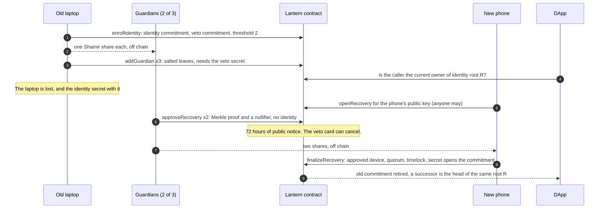

# Lantern

**Lantern lets hidden guardians restore a lost Midnight identity secret, and proves it is the right one.**

This project is built on the Midnight Network.

[](https://github.com/OoJae/lantern/actions/workflows/compile.yml)
[](https://github.com/OoJae/lantern/actions/workflows/test.yml)
[](https://github.com/OoJae/lantern/actions/workflows/web.yml)
· Licence: [Apache-2.0](LICENSE)

| | |
|---|---|
| **Try it, no install** | [lantern-midnight.vercel.app/demo](https://lantern-midnight.vercel.app/demo): the recovery, run by the compiled contract in your browser · [/attacks](https://lantern-midnight.vercel.app/attacks): try to find the guardians |
| **Check it in five minutes** | [Quickstart](#quickstart) |
| **Threat model** | [SECURITY.md](SECURITY.md) |
| **Chain evidence** | [`deployments/`](deployments/) · [`docs/spikes.md`](docs/spikes.md) |

## In one minute

Lantern lets hidden guardians restore a lost Midnight identity secret, and proves it is the right one.

**The problem.** On Midnight, the secret a contract checks lives in one device's private state, and Midnight's own security guide says: "You cannot recover a witness secret from the chain." A wallet seed restores keys, not private state. Lose the device and you lose the identity, and everything that gates on it.

**How Lantern solves it.** You split your identity secret among guardians off chain. On chain, each guardian is only a salted commitment in a Merkle tree, so the public record does not say who they are. After a loss, the guardians approve one specific new device with zero-knowledge proofs. Each approval leaves an opaque nullifier, adds one to a public count and discloses which past root of the guardian tree it proved against; none of these says which guardian approved. Everyone then has 72 hours of public notice, and a separate veto card that no guardian holds can cancel the recovery. Finally the new device proves, inside the circuit, that the secret it rebuilt opens the original commitment, so a tampered share is refused. A DApp that gates on your identity root accepts the new secret and refuses the old one without changing anything it stores; an independently deployed DApp does the same once its committee seals a snapshot taken after the recovery.

**Core features.**
- A recovery is provably correct: the circuit checks the rebuilt secret against the enrolment commitment, not only that enough people agreed.
- The guardians stay hidden: `npm run attack` names every guardian of three vulnerable designs from public data, and none of Lantern's.
- A thief with the old laptop cannot add or evict guardians, veto, or stop the owner's recovery: each of those needs the veto card, kept apart from the laptop. Guardians who pool their shares cannot add or evict guardians or veto either, but they can open and approve a recovery of their own. The owner's veto card cancels it within the 72 hours.
- The recovering phone holds no wallet. A sponsor pays its fees, and no circuit trusts the fee payer.
- DApps keep working across the loss, through an in-contract gate or, for independent contracts, a committee snapshot whose Schnorr signatures are verified in the circuit.

**Usage flow.** Enrol and deal one share to each guardian → lose the device → anyone opens a recovery for the new phone → the guardians check the phone's fingerprint and approve → a 72-hour public window, in which the veto card can cancel → the phone finalizes → DApps that gate on your identity root accept the phone and refuse the old secret.


## For reviewers

The official criteria and their weights, and where each is evidenced:

| Criterion | Weight | Where to look |
|---|---:|---|
| Engineering & Implementation | 40% | [`contracts/src/lantern.compact`](contracts/src/lantern.compact) and [`host.compact`](contracts/src/host.compact); [How Lantern uses Midnight](#how-lantern-uses-midnight): the dual ledger, private state and each primitive by file; `npm run compile:check` |
| Quality Assurance & Reliability | 15% | 190 tests in [`test/`](test/), including a leak scanner with a positive control and tests of the committed chain records; 15 browser tests, run in Chromium in CI and in WebKit and Firefox before release; CI on Node 20, 22 and 24; [21 defects found and fixed](#found-and-fixed-in-review) |
| Product & Vision | 15% | [Who it is for](#who-it-is-for-and-why-now), [Roadmap](#roadmap), [Limitations](#limitations) |
| User Experience & Design | 15% | [The hosted demo](https://lantern-midnight.vercel.app/demo): every accept and refusal comes from the compiled contract, and each contract call shows how the same step went in the local-chain run. Deep links (`/demo?beat=7`), a phone layout and automated accessibility checks |
| Communication | 10% | This README and [SECURITY.md](SECURITY.md) |
| Business Development & Viability | 5% | [Who it is for, and why now](#who-it-is-for-and-why-now) |

## Quickstart

```sh
git clone https://github.com/OoJae/lantern && cd lantern
npm install && npm test   # 190 tests in a few seconds; no Compact toolchain, no Docker
npm run attack            # four guardian designs, one attacker: three broken, Lantern holds
npm run story             # the whole recovery, 74 steps, each outcome asserted
```

`npm test` needs no compiler because the generated contract modules are committed. CI recompiles them from source on every push and fails on any difference.

**Compile the contracts.** Install the Compact developer tools and pin the compiler:

```sh
curl --proto '=https' --tlsv1.2 -LsSf https://github.com/midnightntwrk/compact/releases/latest/download/compact-installer.sh | sh
compact update 0.31.1
npm run compile:check     # about 1 s: recompiles every contract, then diffs the committed modules byte for byte
npm run compile           # about 30 s: every contract with its keys, Lantern's 17 proving circuits and the adversarial contracts' 9
npm run cost:check        # after compile (needs python3): every shipped circuit at k ≤ 14, and the table below
```

Why 0.31.1: it is the compiler Midnight's [compatibility matrix](https://docs.midnight.network/relnotes/support-matrix) lists for Preview, Preprod and Mainnet. The matrix also lists the compact-runtime 0.16.0, on-chain runtime 3.0.0, Midnight.js 4.1.1, Wallet SDK 1.2.0 and proof server 8.1.0 that Lantern pins (checked 2026-09-24). The local chain's node and indexer images, midnight-node 1.0.0 and indexer-standalone 4.3.3, are older than the ones the matrix lists for the public networks; they run only on the local chain. The [installation guide](https://docs.midnight.network/getting-started/installation) says why to pin: "A bare `compact update` installs the newest published release, which can target a ledger version that is not yet deployed on the public networks". The newest release, 0.34.0, does not compile the vendored Foundation `schnorr.compact`: its `ecMulGenerator` now takes a `JubjubScalar`. If the GitHub CLI is logged in, the compile scripts pass its token to `compact` for that run only, to avoid GitHub API rate limits.

**The browser demo, locally:**

```sh
npm run web:install
npm run web                                 # the dev server, http://localhost:5173 (Node 22.12 or later); runs until Ctrl-C
npm run web:build && npm run web:preview    # or the production build with the hosted site's headers, http://localhost:4319
npx --prefix web playwright install chromium   # once, before the first browser-test run; on Linux or WSL add --with-deps
npm run web:e2e                             # the 15 browser tests in Chromium, at desktop size and as an emulated Pixel 7
```

**Real proofs on a local chain** (Docker, Node 24 or later, compact 0.31.1):

```sh
npm run devnet -- --quick   # the core recovery: about 15 min
npm run devnet              # all 74 steps: about 23 min
npm run devnet:verify       # while the chain runs: re-check the full run's record against it (after --quick, add -- --quick)
npm run devnet:bench        # prove the shipped 72-hour finalizeRecovery, without submitting it
npm run devnet:down
```

### Requirements and troubleshooting

- **Node** 20.19 or later on Node 20, or 22.12 or later, for the tests, the attack and the story (the test runner's Vite declares the same); 22 or 24 recommended. The web demo needs 22.12 or later, and the local chain 24 or later.
- **`npm install` warns `EBADENGINE`** on Node 20 and 22 for `@midnight-ntwrk/midnight-did-jubjub-schnorr`, which declares Node 24. It is harmless here: Lantern uses it only to generate committee keys and sign committee votes off chain, and CI runs the whole suite on Node 20, 22 and 24.
- **Windows:** use WSL for the Compact tools.
- **The first `npm run devnet`** pulls three images (node, indexer, proof server), and the proof server downloads its proving parameters. Allow extra time.
- **A devnet or bench run rewrites `deployments/*.json`.** `git diff deployments/` compares your run with ours; `git checkout deployments/` restores ours.

## What is real, and where

| Where | Circuits | Ledger | Zero-knowledge proofs | Fees |
|---|---|---|---|---|
| The hosted demo, `npm run web` | the compiled contract's generated JavaScript ([`web/src/lib/engine.js`](web/src/lib/engine.js)) | in memory, in your browser | none | none |
| `npm test`, `npm run story`, `npm run attack` | the same modules | in memory | none | none |
| `npm run devnet` | the same source with one line changed: a 60-second timelock instead of 72 hours ([`devnet/flavour.mjs`](devnet/flavour.mjs)) | a local Midnight node and indexer | real, from a local proof server | real DUST |
| `npm run devnet:bench` | the shipped build | in memory: a recovery opened 73 hours ago, built with the simulator | real: the shipped 72-hour `finalizeRecovery` | none; not submitted |
| CI | compiled from source on every push | in memory | none; keys are generated, not used | none |

The hosted demo makes no network request after it loads, and a browser test enforces that ([`web/e2e/network.spec.js`](web/e2e/network.spec.js)).

## How it works



1. **Enrol.** The owner's device commits to an identity secret and to a separate veto secret, and sets a threshold.
2. **Deal.** It splits the identity secret with Shamir's scheme and gives each guardian one share, off chain. Each guardian is registered as a salted commitment in a Merkle tree, and adding one needs the veto secret. The threshold and the number of guardians are public; who the guardians are is not.
3. **Open and approve.** After a loss, anyone opens a recovery for the new device's public key. Each guardian checks that key with the owner out of band, then approves with a Merkle membership proof. The approval writes a nullifier and adds one to the recovery's public approval count; neither says which guardian approved.
4. **Wait, or veto.** Nothing can finalize for 72 hours. A recovery the owner did not start is public, and the veto card kills it.
5. **Finalize.** The new device proves that it holds the approved key, that the quorum is met, that the timelock has passed and that the rebuilt secret opens the enrolment commitment. The old commitment is retired and a successor takes its place under the same identity root, which is the one value a DApp stores.

### Why not derive the secret from the wallet seed?

Then the seed phrase is the only copy. Lose it and nothing brings the identity back; leak it and a thief holds the identity silently, with nothing to rotate it away from them. Midnight's [security guide](https://docs.midnight.network/guides/security-best-practices) is direct about the choice: "Decide your recovery model before you deploy: multiple authorized keys, a recovery circuit gated on a separate secret, or a threshold of guardians." Lantern implements the threshold of guardians, and adds a separate secret that on its own can only cancel, and that is also required to add or evict guardians.

## How Lantern uses Midnight

Two contracts, [`lantern.compact`](contracts/src/lantern.compact) (10 circuits) and [`host.compact`](contracts/src/host.compact) (7), and three modules: [`identity.compact`](contracts/src/identity.compact), [`ownergate.compact`](contracts/src/ownergate.compact) and the Foundation's [`schnorr.compact`](contracts/src/schnorr.compact).

### What is public, and what stays private

| Public: the 16 fields of Lantern's ledger | Private: what never reaches the chain |
|---|---|
| `enrolled`, `thresholds`, `vetoCommits`: identity commitments, thresholds, veto commitments | the identity secret and its salt |
| `guardians`: salted guardian leaves, in a historic Merkle tree | the veto secret and its salt |
| `idRoots`, `lineage`: which commitment descends from which identity root | each guardian's secret and leaf salt |
| `guardianCtx`, `usedGuardianCtx`: each identity root's current guardian context, and every context ever used | the Merkle paths |
| `recoveries`, `approvals`, `approvedNullifiers`: recovery records, approval counts, approval nullifiers | the Shamir shares, combined off chain; no circuit reads them |
| `vetoNullifiers`, `killed`, `retiredIdentities`: vetoes, vetoed recoveries, retired commitments | the new device's ephemeral secret |
| `gateActions`, `gateNullifiers`: actions at the in-contract DApp | |

Every private-to-public crossing is a `disclose()`. What the public fields still reveal, including the liveness oracle an open recovery creates, is in [SECURITY.md §5](SECURITY.md#5-leakage), and `npm run attack` measures it from the ledger.

### The primitives, by file

| Primitive | Where | What it buys |
|---|---|---|
| Witness and ledger split | [`src/witnesses.js`](src/witnesses.js), all of `lantern.compact` | secrets, salts and paths stay on the device |
| `disclose()` as the taint boundary | wherever witness-derived data becomes public: ledger operations, return values, block-time checks | each private-to-public crossing is one greppable token; the leakage audit was built by grepping for it |
| A `persistentCommit` opening as correctness | `idCommitOf`, `finalizeRecovery` | the recovered secret is provably the enrolled one ([SECURITY.md §2](SECURITY.md#2-what-the-circuit-proves--and-what-it-does-not)) |
| Length-typed domain separation | every `*Preimage` struct | preimages from different domains cannot collide |
| `export pure circuit` | 9 derivations, such as `idCommitOf` and `guardianLeafOf` | the client calls the same compiled code as the circuit, so the two cannot drift; CI checks they never acquire a proving key |
| `HistoricMerkleTree` past roots, with the leaf bound before `checkRoot` | `approveRecovery` | concurrent approvals stay valid, and a genuine path cannot be reused for another leaf |
| Nullifiers | approvals, vetoes, gate actions, committee votes | one-shot actions; approval nullifiers bind the guardian's secret, so extra leaves cannot inflate a quorum |
| `Set` non-membership in the circuit | `!retiredIdentities.member(…)` | "current owner" is a negative claim, and this is what makes the in-contract gate sound |
| Increment-only `Counter` with `lessThan` | `finalizeRecovery`, `sealEpoch`, `sealRotation` | quorum by comparison, so a later approval or vote cannot invalidate a finalize or seal proof, while a veto landing first still does (tested for `finalizeRecovery` and `sealEpoch` in [`test/concurrency.test.js`](test/concurrency.test.js)) |
| Block-time bounds in place of a clock | `blockTimeGte` and `blockTimeLt` around `claimedNow()` | the 72-hour lock never ends earlier than 72 hours after the block that opened it |
| In-circuit Jubjub Schnorr | the vendored [`schnorr.compact`](contracts/src/schnorr.compact), in `attestVote` and `rotateVote` | committee attestations are real signature checks; `attestVote`, which verifies one, is 2,520 rows in all |
| Compact modules as shared code | [`identity.compact`](contracts/src/identity.compact), [`ownergate.compact`](contracts/src/ownergate.compact) | both contracts import `identity.compact`, so they compute an identity commitment with the same code. `ownergate.compact` holds the "current owner" rule that `hostGatedAction` applies, for any contract compiled against Lantern's ledger |
| The contract maintenance authority, frozen | every recorded deployment ([`devnet/src/executor.mjs`](devnet/src/executor.mjs)) | replaced by an empty committee with threshold 1, so no one can change a deployed contract's rules |

**Sponsorship.** The recovering phone has lost everything, so it holds no wallet. It proves and binds its call with throwaway keys and hands the transaction to a sponsor, which adds DUST and submits it ([`devnet/src/sponsor.mjs`](devnet/src/sponsor.mjs), spike S4 in [`docs/spikes.md`](docs/spikes.md)). No circuit uses the caller's coin key or any token operation, so nothing trusts the fee payer ([`test/authentication.test.js`](test/authentication.test.js)). In the recorded run the sponsor tries to finalize the recovery for itself, and is refused (step 8.10).

## Measured

**Tests.** 190 Vitest tests in 14 files: lantern 33, succession 31, adversarial 27, host 22, record 16, identity 10, shamir 9, leakscan 8, story 8, concurrency 6, portable 6, authentication 5, devnet 5, host-snapshot 4. Three node:test tests of the sponsor's policy. Fifteen Playwright tests, run in CI in Chromium at desktop size and as an emulated Pixel 7 (30 runs), and before release in WebKit, as an emulated iPhone 15, and in Firefox (45 runs).

**Circuits.** All 17 are ZKIR v2, the deployable ledger-8 path. `npm run cost:check` measures them, and fails if any exceeds k = 14 or if this table differs from the measurement.

<!-- facts:circuits:start -->
| Contract | Circuit | k | Rows | Share of 2^k |
|---|---|---:|---:|---:|
| lantern | `addGuardian` | 14 | 15,783 | 96% |
| lantern | `approveRecovery` | 14 | 11,890 | 73% |
| lantern | `enrollIdentity` | 13 | 7,529 | 92% |
| lantern | `finalizeRecovery` | 14 | 8,561 | 52% |
| lantern | `hostGatedAction` | 14 | 9,088 | 55% |
| lantern | `openRecovery` | 13 | 4,657 | 57% |
| lantern | `proveHeadOwnership` | 14 | 8,394 | 51% |
| lantern | `proveSuccession` | 13 | 3,898 | 48% |
| lantern | `rotateGuardianSet` | 14 | 9,591 | 59% |
| lantern | `vetoRecovery` | 14 | 9,059 | 55% |
| host | `attestVote` | 12 | 2,520 | 62% |
| host | `openEpoch` | 10 | 527 | 51% |
| host | `openRotation` | 10 | 511 | 50% |
| host | `requireCurrentOwnerAttested` | 14 | 9,242 | 56% |
| host | `rotateVote` | 12 | 2,514 | 61% |
| host | `sealEpoch` | 10 | 703 | 69% |
| host | `sealRotation` | 10 | 537 | 52% |
<!-- facts:circuits:end -->

**On a local chain.** `npm run devnet` runs the same story as `npm run story`, with every accepted step a real, proved and finalized transaction. It writes its record only if every step goes as expected.

<!-- facts:chain:start -->
| | Full story ([`local-devnet.json`](deployments/local-devnet.json)) | Core recovery ([`local-devnet-quick.json`](deployments/local-devnet-quick.json)) |
|---|---:|---:|
| Recorded | 2026-09-22 | 2026-09-22 |
| Steps: accepted · refused · off chain | 74: 45 · 15 · 14 | 24: 12 · 5 · 7 |
| Transactions (including 2 deploys and 2 freezes) | 49 | 16 |
| Paid by a sponsor; the device holds no wallet | 8 | 3 |
| Proof time: min / median / max | 0.2 / 0.7 / 2.1 s | 0.7 / 1.3 / 2.1 s |
| Call to finalized, median | 18.6 s | 18.7 s |
| Wall-clock time of the story | 23.3 min | 14.8 min |

Machine: Apple M5 (10 cores), Node v26.0.0; midnight-node:1.0.0, indexer-standalone:4.3.3, proof-server:8.1.0; a single local node, network id `undeployed`. The contracts ran as the devnet flavour: line 120 of `lantern.compact` changed, a 60-second timelock in place of 72 hours.

The **shipped** 72-hour `finalizeRecovery`, proved without being submitted ([`bench-shipped-finalize.json`](deployments/bench-shipped-finalize.json), 2026-09-24): 2 s for the first, cold proof, then 0.8–0.9 s. The same finalize 71 hours after the open is refused locally: "timelock has not elapsed".
<!-- facts:chain:end -->

<details>
<summary>Per circuit</summary>

<!-- facts:chain-circuits:start -->
| Contract | Circuit | Transactions | Proof, median | Proof, range | Call to finalized, median |
|---|---|---:|---:|---:|---:|
| lantern | `addGuardian` | 9 (2 sponsored) | 1.3 s | 0.9–2.1 s | 17.3 s |
| lantern | `approveRecovery` | 5 | 1.4 s | 0.9–2.1 s | 18.7 s |
| lantern | `enrollIdentity` | 3 | 0.8 s | 0.5–1.3 s | 18.7 s |
| lantern | `finalizeRecovery` | 2 (2 sponsored) | 2 s | 1.3–2 s | 20.4 s |
| lantern | `hostGatedAction` | 5 (2 sponsored) | 1.3 s | 0.9–2 s | 18.6 s |
| lantern | `openRecovery` | 3 | 0.7 s | 0.5–1 s | 17.3 s |
| lantern | `proveHeadOwnership` | 2 (2 sponsored) | 2.1 s | 1.1–2.1 s | 18.6 s |
| lantern | `proveSuccession` | 2 | 1.1 s | 0.7–1.1 s | 18.7 s |
| lantern | `rotateGuardianSet` | 1 (1 sponsored) | 1.7 s | 1.7–1.7 s | 22.7 s |
| lantern | `vetoRecovery` | 1 (1 sponsored) | 1.3 s | 1.3–1.3 s | 17.2 s |
| host | `attestVote` | 8 | 0.5 s | 0.3–0.7 s | 18.6 s |
| host | `openEpoch` | 4 | 0.4 s | 0.2–0.5 s | 18.6 s |
| host | `openRotation` | 1 | 0.3 s | 0.3–0.3 s | 18.7 s |
| host | `requireCurrentOwnerAttested` | 4 (1 sponsored) | 1.4 s | 1.1–1.8 s | 23.9 s |
| host | `rotateVote` | 2 | 0.7 s | 0.5–0.7 s | 18.7 s |
| host | `sealEpoch` | 4 | 0.3 s | 0.2–0.3 s | 18.7 s |
| host | `sealRotation` | 1 | 0.3 s | 0.3–0.3 s | 17.4 s |

Both committed runs merged. For an even number of samples the median shown is the upper of the two middle values.
<!-- facts:chain-circuits:end -->

</details>

**Checked against the chain.** `npm run devnet:verify`, captured on 2026-09-24 against the chain that produced the record:

```
verifying deployments/local-devnet.json (full+sponsored, recorded 2026-09-22T23:28:02.315Z)
✓ every recorded step went as the story expected  74 steps
✓ Lantern (devnet flavour): exists on this chain  d4ffaee3434383349185514bfb2f47b8b6c86de20eac5800d79f10f61e8ba33e
✓ Lantern (devnet flavour): maintenance authority frozen, so its rules can never change  committee 0, threshold 1
✓ Lantern (devnet flavour): every on-chain verifier key is byte-identical to a fresh compile  10 of 10 circuits
✓ Lantern (devnet flavour): the flavour differs from the shipped build in finalizeRecovery alone  differs: finalizeRecovery
✓ Lantern (devnet flavour): the ledger ends where the record says  enrolled 3, guardianLeaves 6, recoveries 2, approvals 3, vetoes 1, killed 1, retired 1, lineage 3, guardianSets 3, gateActions 3
✓ LanternHost (unchanged): exists on this chain  ee0ffbcca9dd30fbec35ea0f490d50016a2fe8d9be26e5407d5d804dd3178cf2
✓ LanternHost (unchanged): maintenance authority frozen, so its rules can never change  committee 0, threshold 1
✓ LanternHost (unchanged): every on-chain verifier key is byte-identical to a fresh compile  7 of 7 circuits
✓ LanternHost (unchanged): the ledger ends where the record says  sealedEpochs 4, committeeGen 1, committeeVotes 10, hostActions 4
✓ every sponsored transaction came from a device with no wallet, and only the sponsor spent DUST  8 sponsored
✓ every recorded transaction is on the chain, at its recorded block  49 of 49
The record matches the chain.
```

Offline, [`test/record.test.js`](test/record.test.js) checks both committed records against the story, and the bench record's circuit, timelock and negative control, on every `npm test`.

## The attack

`npm run attack` gives an attacker the whole public ledger of four guardian designs, and an address book of 64 of the owner's contacts that includes the real guardians. It tries every derivation it knows, then prints what Lantern still leaks, field by field. It is also a test: it exits non-zero if a vulnerable design is not fully broken, or if Lantern is.

<!-- facts:attack:start -->
| # | target | scheme | probes | guardians named | votes linked | verdict |
|---|---|---|---:|---:|---:|---|
| 1 | PublicGuardians | `identifiers stored in clear` | 0 | 3 / 3 | 2 / 2 | **BROKEN** |
| 2a | lantern-v0 · unsalted leaf | `H(domain, id, owner)` | 64 | 3 / 3 | 2 / 2 | **BROKEN** |
| 2b | lantern-v0 · derived salt | `commit(…, H(owner, slot))` | 512 | 3 / 3 | 2 / 2 | **BROKEN** |
| 3 | lantern  (shipped) | `commit(secret‖ctx, salt)` | 268 | 0 / 3 | 0 / 2 | **HELD** |
<!-- facts:attack:end -->

1. **Guardian identifiers stored in the clear**, the common EVM social-recovery pattern of guardian addresses kept in contract storage: read straight from the ledger.
2. **Lantern's own first draft** ([`vulnerable-lantern-v0.compact`](contracts/adversarial/vulnerable-lantern-v0.compact)): (a) an unsalted hash of the guardian's identifier, broken by hashing every contact; (b) a proper commitment whose salt is derived from public data, which costs the attacker a factor of eight and nothing more.
3. **The shipped contract**: 32 bytes of per-guardian entropy that are not a function of who the guardian is. Handed the real names, the attacker still confirms none.

A commitment hides exactly the entropy in its preimage that is not already on chain, and not one bit more. The two vulnerable contracts are compiled, never deployed ([`contracts/adversarial/`](contracts/adversarial/)).

## Security in one table

From [SECURITY.md §1](SECURITY.md#1-the-60-second-version). The rest of SECURITY.md argues each row.

| Property | Status | Enforced by |
|---|---|---|
| A recovery cannot install a wrong secret | **Held** | `finalizeRecovery` asserts `idCommitOf(identitySecret(), idSalt()) == idCommit` |
| A recovery cannot happen silently | **Held** | every approval writes a public nullifier; `recoveries` and `approvals` are publicly readable |
| A recovery cannot finalize early | **Held** | no earlier than 72h after the block that opened it: the timelock runs from the *later* of the two bounds recorded at open |
| A recovery is vetoable by a secret no guardian holds | **Held** | `vetoRecovery`, gated on `vetoSecret`, which is never Shamir-shared |
| Approvals go to the device the guardians were shown | **Held** | `finalizeRecovery` requires the ephemeral secret behind the approved public key |
| Evicting guardians stops their recovery — even one that already reached quorum | **Held** | the guardian context is frozen into the recovery at open and re-checked at finalize |
| Holding only your identity secret — a stolen laptop or malware — cannot mint guardians, evict yours, veto, or stop your recovery. Guardians who pooled their shares cannot mint, evict or veto either, but they can open and approve a recovery of their own, which your veto card stops | **Held** | `addGuardian` and `rotateGuardianSet` also require the veto secret; `vetoRecovery` requires only it. §4.3, §4.5 |
| Guardian *identities* stay private | **Held** — and demonstrated | salted `persistentCommit` leaves; `npm run attack` |
| Guardians survive a recovery, so an identity can be recovered again | **Held** | stable `idRoot`; leaves bind a guardian context, not the rotating commitment |
| A downstream contract keeps working across a key loss | **Held, in-contract** | `hostGatedAction` reads `retiredIdentities` directly |
| An *independently deployed* contract keeps working | **Held, but strictly less sound** | `requireCurrentOwnerAttested` proves the caller holds the current identity secret, against a committee-signed canonical snapshot — but it accepts a retired owner's secret until a snapshot built after the recovery seals, for at most 24 h after the latest seal. §4.4 |
| The rules of a deployed instance cannot change | **Held on the recorded local deployment** — not a property of the source | the run that deployed it replaced its maintenance authority with an empty committee. While that chain runs, `npm run devnet:verify` re-checks this and that every on-chain verifier key matches a fresh compile; offline, `test/record.test.js` checks the committed records (`deployments/`). Any other deployer can keep the key: check before you trust an instance |
| Nothing trusts the fee payer | **Held** | no circuit uses the caller's coin key or any token operation; every check is a commitment opening or a signature. `test/authentication.test.js` |
| Guardian *count* and *threshold* stay private | **Not held** | `thresholds` is public; `n` is recoverable from transaction history |
| t colluding guardians cannot take the identity | **Not held.** Nothing here claims otherwise. Until your recovery finalizes they can also act as you | §4.3 |

Lantern turns *"your private state is gone forever"* into *"your private state can be restored, correctly, by people you chose — and if they turn on you, you get 72 hours of public notice and a veto they cannot hold."* It does not turn it into *"your guardians cannot betray you."*

## Found and fixed in review

We threat-modelled our own code and found 21 real defects. Each was reproduced before it was fixed. Twenty have a regression test named after them; the twenty-first was fixed by removing the feature. Three of them:

- **Rotation was gated on the identity secret alone.** Whoever held it, a thief with the lost laptop or guardians who pooled their shares, could kill the owner's recovery after it reached quorum and evict the guardians: a permanent lockout. Our own earlier fix made it possible. Regression: `the stolen-device lockout: the thief cannot kill a recovery that reached quorum`.
- **Privacy tests searched for Field secrets big-endian.** The runtime stores them little-endian, so the tests could never fail. Now every scan must first find the secret in the private transcript ([`test/leakscan.test.js`](test/leakscan.test.js)).
- **The attested host gate read no identity witness.** Anyone passed it for any pair in the signed snapshot: a membership predicate, not an authorisation. Regression: `refuses a caller who does not hold the current identity secret`.

All 21 are in [SECURITY.md §7](SECURITY.md#7-found-and-fixed-in-review).

## Who it is for, and why now

**Users.** Anyone a private DApp knows only by a commitment: a credential holder, a DAO member, a pseudonymous account. Losing a phone should not end that identity, and protecting it should not mean publishing who you trust.

**Builders.** A DApp that gates on "the current owner of identity root R" gets recovery without writing any, and stores one value: the root. If its circuits sit in the same contract as Lantern's ledger, it passes three facts from that ledger to one shared predicate ([`ownergate.compact`](contracts/src/ownergate.compact)) and checks that the caller holds the current identity secret, as `hostGatedAction` does. An independently deployed one cannot read that ledger: it uses the committee-signed snapshot (`requireCurrentOwnerAttested`) and accepts each snapshot for up to 24 hours after it seals.

**Adoption path.** A wallet or identity app adds enrolment and share dealing. DApps gate on the identity root. Each deployment freezes its maintenance authority, which anyone can check before trusting it, as `npm run devnet:verify` does.

**Korea.** South Korea's amended Personal Information Protection Act was promulgated on 10 March 2026 and took effect on 11 September 2026. The [IAPP](https://iapp.org/news/a/south-korea-overhauls-pipa-and-ties-fines-to-ceo-accountability) reports that it "introduces a penalty ceiling of 10% of total turnover" and "places personal supervisory liability on the CEO"; [Hunton](https://www.hunton.com/privacy-and-cybersecurity-law-blog/south-korea-amends-privacy-law-to-authorize-fines-of-up-to-10-of-total-revenue) describes fines "of up to 10% of a company's total revenue in certain high-severity data breach cases", subject to transition rules. *Our reading, not legal advice:* a public list of who can recover whose identity is personal information about named people and their relationships. A guardian design that stores it in the clear publishes it to everyone, permanently. Lantern keeps it off the public record by construction, and `npm run attack` checks that it does.

**Midnight's own direction.** Midnight's Passport project decided in 2026/07 to use BUSS (ANARKey) stateless guardians with paper keys for total-loss recovery ([component C14](https://github.com/midnightntwrk/passport/blob/main/docs/plans/components/C14-total-loss-recovery-flow.md)). Lantern is a different point in the same space: an on-chain guardian set that stays hidden, a recovery that proves its own correctness in the circuit, and a veto credential that no guardian holds.

## Roadmap

1. **Rate-limit `openRecovery`**, with a bond or an escalating delay. Today one fee buys one more recovery the owner must veto; this is the largest gap between Lantern and a production system ([SECURITY.md §6.4](SECURITY.md#6-known-limitations)).
2. **Reconstruct in a disposable worker**, so a rebuilt secret cannot linger in the heap (§6.5).
3. **Make the committee size a constructor parameter**; it is fixed at three.
4. **A delegation-safe gate.** Every gate today takes its secret as a witness, so a remote prover learns it. A signature gate would not.
5. **Cross-contract calls**, when Midnight ships them: an independent DApp could read Lantern directly and drop the 24-hour committee window.
6. **Deploy to Preprod**, with the maintenance authority frozen, and put the enrolment flow in front of real users.
7. **An external audit.**

## Limitations

- **Colluding guardians win.** *t* guardians who collude can take the identity. What you get is public notice, 72 hours and a veto they cannot hold, and until your recovery finalizes they can also act as you.
- **The threshold and guardian count are public.** Only who the guardians are is hidden.
- **Opening a recovery is permissionless.** The recovering device holds no secret to authenticate with, so an open recovery tells the world an identity's owner may have lost a key, and whether a veto arrives says whether they are watching.
- **An independently deployed DApp** accepts a retired secret until the committee seals a snapshot built after the recovery. Each snapshot expires 24 hours after it seals, not after it was built, so the 24-hour bound assumes the committee proposes and seals promptly.
- **A delegated prover learns the secrets.** Every role in the recorded runs shares one local proof server.
- **Losing the veto card** means you cannot veto a recovery, add a guardian or evict the set until a recovery issues a new one.
- **An unreachable threshold makes the identity unrecoverable.** At enrolment there are no guardians yet, so the contract cannot check that *t* is at most the number you will add. The client must.
- **Evidence comes from a single-node local chain.** Nothing is deployed to Preprod or mainnet, and nothing is audited.
- **The browser demo makes no proofs.** It runs the compiled circuits against an in-memory ledger; the proofs are in `npm run devnet`.
- **Out of scope:** share transport between owner and guardians, wallet UX and login.
- **Upstream:** `midnight-js` issues #1234 and #1169 document silent private-state corruption, and the veto secret lives in that state.

The causes and bounds are in SECURITY.md: the adversaries in [§4](SECURITY.md#4-the-adversaries-scored-separately), leakage in [§5](SECURITY.md#5-leakage), what we have not tested in [§9](SECURITY.md#9-where-our-rigour-stops), and the code's known limitations in [§6](SECURITY.md#6-known-limitations), which lists more than this page does.

## Repository map

```
contracts/src/          lantern.compact, host.compact, identity.compact, ownergate.compact, schnorr.compact (vendored)
contracts/managed*/     the generated modules, committed; proving keys are not
contracts/adversarial/  two deliberately insecure contracts for npm run attack; never deployed
src/                    Shamir over the scalar field, identity derivation, witnesses, the leak scanner
src/attack/             the attack engine and the per-field leak classification
src/demo/               the story: 74 steps, run unchanged by the simulator, the browser and the local chain
src/host/               the canonical host snapshot the committee signs
test/                   190 tests
web/                    the browser demo (React and Vite) and its Playwright tests
devnet/                 the local-chain runner: flavour, sponsor, verify and bench
deployments/            the records of the local-chain runs and the bench
scripts/                compile, cost, attack, story and the README's generated facts
docs/spikes.md          nine assumptions, each tested before anything was built on it
SECURITY.md             the threat model
```

## Credits

- [`contracts/src/schnorr.compact`](contracts/src/schnorr.compact) is vendored byte-identical from [midnightntwrk/midnight-did](https://github.com/midnightntwrk/midnight-did) (Apache-2.0, © 2025 Midnight Foundation). Its npm package generates the committee's keys and signs its votes.
- The Vite and WebAssembly setup and the local-chain compose file follow the author's earlier OnePledge project (2026/09), itself after [midnightntwrk/example-zkloan](https://github.com/midnightntwrk/example-zkloan) (Apache-2.0).
- CI installs the compiler with [midnightntwrk/setup-compact-action](https://github.com/midnightntwrk/setup-compact-action).
- [Midnight's documentation](https://docs.midnight.network/), quoted above.

**Provenance.** Lantern's first commit is dated 2026-09-22, after the hackathon opened on 2026-09-01; the git history is the record. OnePledge, whose setup Lantern borrows, began on 2026-09-13. All people in the story are fictional.

## Licence

[Apache-2.0](LICENSE). Maintained by [@OoJae](https://github.com/OoJae). To report a vulnerability, see [SECURITY.md](SECURITY.md#9-where-our-rigour-stops).
