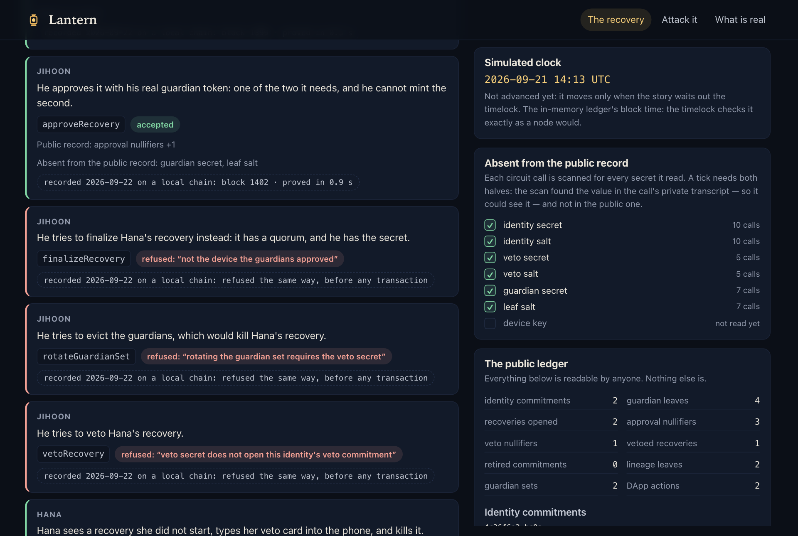
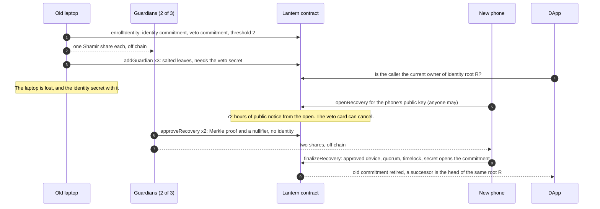

# Lantern

English · [한국어](README.ko.md)

**Lantern lets hidden guardians restore a lost Midnight identity secret, and proves it is the right one.**

This project is built on the Midnight Network.

[](https://github.com/OoJae/lantern/actions/workflows/compile.yml)
[](https://github.com/OoJae/lantern/actions/workflows/test.yml)
[](https://github.com/OoJae/lantern/actions/workflows/web.yml)
· Licence: [Apache-2.0](LICENSE)

| | |
|---|---|
| **Try it, no install** | [lantern-midnight.vercel.app/demo](https://lantern-midnight.vercel.app/demo): the recovery, run by the compiled contract in your browser, then [try to break it yourself](https://lantern-midnight.vercel.app/demo#break) · [/live](https://lantern-midnight.vercel.app/live): the shipped contract's recovery on Preprod, beside the whole story and Lantern v2, all three checked in your browser · [/rehearse](https://lantern-midnight.vercel.app/rehearse): a recovery with your own guardians · [/kit](https://lantern-midnight.vercel.app/kit): practice recovery kits, in words · [/attacks](https://lantern-midnight.vercel.app/attacks): try to find the guardians · [/about](https://lantern-midnight.vercel.app/about): what is real |
| **Check it in five minutes** | [Quickstart](#quickstart) |
| **Threat model** | [SECURITY.md](SECURITY.md) |
| **On Midnight's public test network** | [the whole story](#the-whole-story), 74 steps with the recovery finalized, on [Lantern, with a 60-second timelock](https://preprod.midnightexplorer.com/contracts/bac79cd962f547ac070802a221f9f7260bffa4724e6180ef3c874eadabb85101) and [LanternHost](https://preprod.midnightexplorer.com/contracts/a53b489179903e1b40a8078b59649af9b113a4d9d7da0d8f293e97314b59b68d) · [the shipped contract](https://preprod.midnightexplorer.com/contracts/bfd4fa7780902551422b932e7acf8b61fc077dba21afb1be3df1090a25b352c9), its 72-hour recovery open · [Lantern v2](https://preprod.midnightexplorer.com/contracts/6ed46d5d7dc667e5b212b155f376c4914a693dfd45b3d033ada69e3551971fa4), deployed beside the shipped contract, not in its place, with each v2 rule run once ([the record](#lantern-v2-on-preprod)) · [check all three yourself](#on-midnights-public-test-network), in a terminal or [in your browser](https://lantern-midnight.vercel.app/live) |
| **Chain records, local and on Preprod** | [`deployments/`](deployments/) · [`docs/spikes.md`](docs/spikes.md) |
| **Prior art, posted upstream** | [a note on Passport's total-loss recovery, issue #20](https://github.com/midnightntwrk/passport/issues/20#issuecomment-5821240645) · [the note](docs/upstream/passport-c14-prior-art.md) |
| **Brand** | [lantern-midnight.vercel.app/brand](https://lantern-midnight.vercel.app/brand) · [`brand/README.md`](brand/README.md) |

## In one minute

Lantern lets hidden guardians restore a lost Midnight identity secret, and proves it is the right one.

**The problem.** On Midnight, the secret a contract checks lives in one device's private state, and Midnight's own security guide says: "You cannot recover a witness secret from the chain." A wallet seed restores keys, not private state. Lose the device and you lose the identity, and everything that gates on it.

**How Lantern solves it.** You split your identity secret among guardians off chain. On chain, each guardian is only a salted commitment in a Merkle tree, so the public record does not say who they are. After a loss, anyone opens a recovery for one specific new device, and from that moment everyone has at least 72 hours of public notice, in which a separate veto card that no guardian holds can cancel it. The guardians approve that device with zero-knowledge proofs. Each approval leaves an opaque nullifier, adds one to a public count and discloses which past root of the guardian tree it proved against; none of these says which guardian approved. Finally the new device proves, inside the circuit, that the secret it rebuilt opens the original commitment, so a tampered share is refused. A DApp that gates on your identity root (the stable identifier it stores, which survives a recovery) accepts the new secret and refuses the old one without changing anything it stores; an independently deployed DApp does the same once its committee seals a snapshot taken after the recovery.

**Core features.**
- A recovery is provably correct: the circuit checks the rebuilt secret against the enrolment commitment, not only that enough people agreed.
- The guardians stay hidden: `npm run attack` names every guardian of three vulnerable designs from public data, and none of Lantern's.
- A thief with the old laptop cannot add or evict guardians, veto, or stop the owner's recovery: each of those needs the veto card, kept apart from the laptop. That holds if the laptop kept no guardian kits: it creates each guardian's kit (secret, leaf salt and share) while dealing, so it must erase each kit once that guardian is added ([SECURITY.md §8](SECURITY.md#8-operational-guidance)). Guardians who pool their shares cannot add or evict guardians or veto either, but they can open and approve a recovery of their own. The owner's veto card cancels it at any time before it finalizes, at least 72 hours after the open.
- The recovering phone holds no wallet. A sponsor pays its fees, and no circuit trusts the fee payer.
- DApps keep working across the loss, through an in-contract gate or, for independent contracts, a committee snapshot whose Schnorr signatures are verified in the circuit.

**Usage flow.** Enrol and deal one share to each guardian → lose the device → anyone opens a recovery for the new phone, which starts a 72-hour public window in which the veto card can cancel → the guardians check the phone's fingerprint and approve → the phone finalizes → DApps that gate on your identity root accept the phone and refuse the old secret.

**Where it runs.** The whole story, 74 steps in 49 transactions, ran with real proofs and a 60-second timelock on a local chain and on Midnight's Preprod test network, with the recovery finalized; the shipped contract is on Preprod too, with a real 72-hour recovery open. [Lantern v2](docs/v2.md), a separate contract that adds rate-limited opens and an emergency lock, is deployed on Preprod beside the shipped contract, not in its place, and each of its rules has run there once. Anyone can check all three with no wallet, [in a terminal](#on-midnights-public-test-network) or at [/live](https://lantern-midnight.vercel.app/live). 560 unit tests and 213 browser tests.



## For reviewers

What Lantern contributes to each judging criterion, the evidence, and one command or link to check it yourself. Commands run from a fresh clone after `npm ci`, unless the row says otherwise.

### The four review steps

| The organisers' step | Do this | What you should see |
|---|---|---|
| 1. "Clone … and compile it" | `git clone https://github.com/OoJae/lantern && cd lantern && npm ci && npm test`, then, with compact 0.31.1 ([Quickstart](#quickstart)), `npm run compile:check` | all 560 unit tests pass, 293 for shipped Lantern and 267 for Lantern v2, in under a minute, with no toolchain and no Docker; then every contract recompiles from source and matches the committed modules byte for byte, Lantern v2's included |
| 2. The form's description matches the README | Read the form beside [In one minute](#in-one-minute), which it summarises | the same claims and the same numbers. Every chain, circuit and attack table in this README is generated from its source, and CI fails if one drifts (`npm run readme:check`, and `npm run cost:check` for the circuits) |
| 3. "How clearly the project uses Midnight's features" | [How Lantern uses Midnight](#how-lantern-uses-midnight) | what is public and what stays private, field by field, and each Midnight primitive with the file that uses it and what it buys. [SECURITY.md §3](SECURITY.md#3-where-the-security-comes-from-midnight-primitives-by-file-and-circuit) argues each one |
| 4. "Check that we can access and verify the demo" | Open [lantern-midnight.vercel.app/demo](https://lantern-midnight.vercel.app/demo). Then open [/live](https://lantern-midnight.vercel.app/live) and press **Check it against the chain**. For the full check against Preprod, follow [these commands](#on-midnights-public-test-network) (Node 24, compact 0.31.1), `LANTERN_NETWORK=preprod npm run devnet:verify:v2` among them for Lantern v2, deployed there beside the shipped contract | the recovery, run by the compiled contract in your browser with nothing to install. Then, from your browser, every transaction of the whole story, the shipped contract and Lantern v2 at its recorded block, and each contract with its rules frozen and verifier keys whose SHA-256 match a compile of this repository (pinned in [`web/src/live/keys.js`](web/src/live/keys.js), which CI checks against a fresh compile). From each full check, which also compiles the contracts afresh: "The record matches the chain." |

### Each criterion

| Criterion | What Lantern contributes | Evidence | Check it |
|---|---|---|---|
| **Engineering & Implementation** · 40% | A recovery the circuit proves correct: `finalizeRecovery` accepts only a rebuilt secret that opens the enrolment commitment. Guardians stay hidden even while they approve, a veto card no guardian holds can cancel, and the recovering phone holds no wallet. Two Compact contracts with 17 circuits, each at k ≤ 14; the whole 74-step story ran with real proofs on a local chain and on Preprod. [Lantern v2](docs/v2.md), a third contract, adds rate-limited opens, an emergency lock, a delay chosen at enrolment and private guardian check-ins, in 13 circuits, each at k ≤ 14. It is deployed on Preprod beside the shipped contract, not in its place, and each v2 rule ran there once: 12 steps accepted and 4 refused by the circuit's own asserts | [`lantern.compact`](contracts/src/lantern.compact), [`host.compact`](contracts/src/host.compact), [`lantern2.compact`](contracts/v2/lantern2.compact); [How Lantern uses Midnight](#how-lantern-uses-midnight); [Measured](#measured); [the whole story on Preprod](#the-whole-story); [Lantern v2 on Preprod](#lantern-v2-on-preprod) | `npm run compile:check`; for v2, `npm run compile:v2`, then `npm run cost:check:v2` (after `npm run compile`, `cost:check:v2` alone); against Preprod, after `npm ci --prefix devnet`, `LANTERN_NETWORK=preprod npm run devnet:verify:v2` |
| **Quality Assurance & Reliability** · 15% | 560 unit tests (293 for shipped Lantern, 267 for [Lantern v2](docs/v2.md)) in under a minute with no toolchain, among them a leak scanner with a positive control and tests of every committed chain record. 213 browser tests, run in CI in Chromium (desktop and an emulated Pixel 7) and before release in WebKit and Firefox, with accessibility checks on every page. `npm run attack` and `npm run story` exit non-zero on any unexpected outcome. We found 21 defects in our own review; each was reproduced first, and 20 have a regression test named after them | [`test/`](test/), [`web/e2e/`](web/e2e/), [CI on Node 20, 22 and 24](https://github.com/OoJae/lantern/actions), [Found and fixed in review](#found-and-fixed-in-review) | `npm test` |
| **Product & Vision** · 15% | Recovery for anyone a private DApp knows only by a commitment. A DApp stores one value, the identity root, and keeps working across a loss without writing any recovery code. The owner-safety gaps our research found are answered in the product now (alerts, in the tab and from `npm run watch`; a rehearsal; practice kits in words) and built for the contract in Lantern v2, deployed on Preprod beside the shipped contract: rate-limited opens, an emergency lock, a delay chosen at enrolment and private guardian check-ins | [Who it is for](#who-it-is-for-and-why-now), [Roadmap](#roadmap), [Limitations](#limitations), [`docs/v2.md`](docs/v2.md) | [/live](https://lantern-midnight.vercel.app/live) → **Watch an identity** → **Use the demo identity** |
| **User Experience & Design** · 15% | A reviewer can do a recovery, not only watch one: rehearse it with your own guardians, try to break it, and follow the real one on Preprod. Every accept and refusal comes from the compiled contract, in its own words. Deep links (`/demo?beat=7`), a phone layout, reduced motion respected, automated accessibility checks, and one brand across the site, the brand kit and the deck | [/demo](https://lantern-midnight.vercel.app/demo), [/demo#break](https://lantern-midnight.vercel.app/demo#break), [/rehearse](https://lantern-midnight.vercel.app/rehearse), [/attacks](https://lantern-midnight.vercel.app/attacks), [the brand guide](brand/README.md) | [lantern-midnight.vercel.app/rehearse](https://lantern-midnight.vercel.app/rehearse) |
| **Communication** · 10% | Every chain, circuit and attack table in this README is generated from its source and checked in CI. [SECURITY.md](SECURITY.md) says what the circuit proves and what it does not, scores each adversary separately and lists all 21 defects. A summary in Korean, Lantern v2's design and build, a note to Midnight's Passport team, and the deck's text with its sources | [SECURITY.md](SECURITY.md), [README.ko.md](README.ko.md), [`docs/v2.md`](docs/v2.md), [the Passport note](docs/upstream/passport-c14-prior-art.md), [the deck](#the-deck) | `npm run readme:check` |
| **Business Development & Viability** · 5% | Integrators: Midnight Passport, as a recovery profile; wallets and identity apps; DApps that gate on an identity root; Korean services that must not publish who guards whom. Distribution: an SDK, to be packaged from the client code in `src/`, plus a hosted sponsor and watcher | [Who it is for, and why now](#who-it-is-for-and-why-now), [the Passport comment](https://github.com/midnightntwrk/passport/issues/20#issuecomment-5821240645), [the deck's business slide](docs/deck/slides.md#slide-12-who-integrates-it-and-the-ask) | `npm run attack`: 0 of 3 guardians named from public data |

### Try it yourself

- **[lantern-midnight.vercel.app/live](https://lantern-midnight.vercel.app/live)**, "On Preprod", read in your browser from Preprod's public indexer:
  - **The shipped contract's recovery**: its approvals, and when it can finalize (2026-09-27 15:03 UTC), with a countdown until then and the finalize once it lands.
  - **A timeline** of every call, with its block, time and circuit.
  - **Lantern v2**, a separate contract and not the shipped one: its four rules, each of its 16 steps with the circuit's own message for each refusal, its public counts read from the chain, and a timeline of its 15 transactions.
  - **Check it against the chain**: in your browser, every transaction in [`preprod.json`](deployments/preprod.json), [`preprod-shipped.json`](deployments/preprod-shipped.json) and [`preprod-v2.json`](deployments/preprod-v2.json) at its recorded block, Lantern v2's counts and identity where its record ends, and each contract with its rules frozen and verifier keys whose SHA-256 match a compile of this repository (pinned in [`web/src/live/keys.js`](web/src/live/keys.js); after `npm run compile`, `npm run keys:check` compares them, as CI does). The full checks, which also compile the contracts afresh, are `LANTERN_NETWORK=preprod npm run devnet:verify` for the whole story and `LANTERN_NETWORK=preprod node devnet/src/shipped.mjs verify` for the shipped contract; `LANTERN_NETWORK=preprod npm run devnet:verify:v2` checks Lantern v2.
  - **Watch an identity**: paste an identity commitment to see every recovery opened for it and, while the tab is open, be told when a new one appears. The page never sends the identity to the indexer or to this site: it reads the contracts' public state and looks for it in your browser. With no tab open, `LANTERN_NETWORK=preprod npm run watch -- --id <commitment>` does the same from a terminal or a server, and `--webhook-file <file>` (or `LANTERN_WEBHOOK=<url>`) sends each alert on; a Slack or Discord webhook URL is a secret, so keep it off the command line, where other users can read it with `ps`. Run from cron with `--once --state <file> --webhook-file <file>`, it alerts only on what changed since its last run. An alert the webhook does not take is sent again on the next run; redirects are not followed. `--once` exits 2 when a contract could not be read (including one the indexer does not know), an alert was not delivered, the state file could not be written, or the identity is on no watched contract. Recoveries are matched on the identity's whole lineage, so a commitment since succeeded by a recovery still sees the current one's. It needs Node 24 and compact 0.31.1, set up as for the [full check](#on-midnights-public-test-network).
- **[/rehearse](https://lantern-midnight.vercel.app/rehearse)**, in your browser rather than on the chain: choose three to five guardians and a threshold, deal their kits, lose the device, and see the recovery through, phishing call included. It runs the compiled circuits, with no network and no proofs, as `/demo` does.
- **[/kit](https://lantern-midnight.vercel.app/kit)**: practice kits, made in your browser: a printable veto card for the owner, guardian kits in words, and the new device's fingerprint as six words (66 bits), which a guardian compares aloud before approving.

### The deck

- **The deck**, in Google Slides: [docs.google.com/presentation/d/18uyCn49…](https://docs.google.com/presentation/d/18uyCn49KgutkaMVVv3dlBlRJ4khVXkCOPaWQgRw4tiQ).
- **The demo film**, 2 min 23 s, every shot a recording of this site: [youtu.be/oapC_yWs4HA](https://youtu.be/oapC_yWs4HA).
- **The deck's text**, slide by slide, with speaker notes and a source for every number: [`docs/deck/slides.md`](docs/deck/slides.md).

## Quickstart

```sh
git clone https://github.com/OoJae/lantern && cd lantern
npm ci && npm test        # 560 tests (v1's 293, v2's 267) in under a minute; no Compact toolchain, no Docker
npm run attack            # four guardian designs, one attacker: three broken, Lantern holds
npm run story             # the whole recovery, 74 steps, each outcome asserted
```

`npm test` needs no compiler because the generated contract modules are committed. CI recompiles them from source on every push and fails on any difference.

**Compile the contracts.** Install the Compact developer tools and pin the compiler:

```sh
curl --proto '=https' --tlsv1.2 -LsSf https://github.com/midnightntwrk/compact/releases/latest/download/compact-installer.sh | sh
compact update 0.31.1
npm run compile:check     # a few seconds: recompiles every contract, Lantern v2's included, then diffs the committed modules byte for byte
npm run compile           # under two minutes: every contract with its keys (17 shipped circuits, 10 + 7; Lantern v2's 13; and 9 adversarial)
npm run cost:check        # after compile (needs python3): every shipped circuit at k ≤ 14, and the table below
npm run cost:check:v2     # after compile (needs python3): every Lantern v2 circuit at k ≤ 14, and the tables in docs/v2.md
```

Why 0.31.1: it is the compiler Midnight's [compatibility matrix](https://docs.midnight.network/relnotes/support-matrix) lists for Preview, Preprod and Mainnet. The matrix also lists the compact-runtime 0.16.0, on-chain runtime 3.0.0, Midnight.js 4.1.1, Wallet SDK 1.2.0 and proof server 8.1.0 that Lantern pins (checked 2026-09-24). The local chain's node and indexer images, midnight-node 1.0.0 and indexer-standalone 4.3.3, are older than the ones the matrix lists for the public networks; they run only on the local chain. The [installation guide](https://docs.midnight.network/getting-started/installation) says why to pin: "A bare `compact update` installs the newest published release, which can target a ledger version that is not yet deployed on the public networks". The newest release, 0.34.0, does not compile the vendored Foundation `schnorr.compact`: its `ecMulGenerator` now takes a `JubjubScalar`. If the GitHub CLI is logged in, the compile scripts pass its token to `compact` for that run only, to avoid GitHub API rate limits.

**The browser demo, locally:**

```sh
npm run web:install
npm run web                                 # the dev server, http://localhost:5173 (Node 22.12 or later); runs until Ctrl-C
npm run web:build && npm run web:preview    # or the production build with the hosted site's headers, http://localhost:4319
npx --prefix web playwright install chromium   # once, before the first browser-test run; on Linux or WSL add --with-deps
npm run web:e2e                             # the 213 browser tests in Chromium, each at desktop size and as an emulated Pixel 7: 426 runs, some skipped by design, such as a layout for the other screen size (stop web:preview first: port 4319 must be free)
npx --prefix web playwright install webkit firefox && npm run e2e:cross --prefix web   # the same 213 in WebKit, as an emulated iPhone 15, and in Firefox
```

**Real proofs on a local chain** (Docker, Node 24 or later, compact 0.31.1):

```sh
npm run devnet -- --quick   # the core recovery: about 15 min
npm run devnet              # all 74 steps: about 23 min
npm run devnet:verify       # while the chain runs: re-check the full run's record against it (after --quick, add -- --quick)
npm run devnet:bench        # prove the shipped 72-hour finalizeRecovery, without submitting it
npm run devnet:v2           # Lantern v2 (docs/v2.md): deploy it as compiled, freeze it, exercise each v2 rule once
npm run devnet:verify:v2    # while the chain runs: re-check the v2 run's record against it, with no wallet
npm run devnet:down
```

### Requirements and troubleshooting

- **Node** 20.19 or later on Node 20, or 22.12 or later, for the tests, the attack and the story (the test runner's Vite declares the same); 22 or 24 recommended. The web demo needs 22.12 or later, and the local chain 24 or later.
- **`npm install` warns `EBADENGINE`** on Node 20 and 22 for `@midnight-ntwrk/midnight-did-jubjub-schnorr`, which declares Node 24 and pnpm 10. It is harmless here, and plain npm works: Lantern uses it only to generate committee keys and sign committee votes off chain, and CI runs the whole suite on Node 20, 22 and 24.
- **Windows:** clone and run everything inside WSL, in its Linux filesystem rather than under `/mnt/c`. The repository checks every text file out with LF line endings (`.gitattributes`), whatever `core.autocrlf` says; native Windows is not tested.
- **The first `npm run devnet`** pulls three images (node, indexer, proof server), and the proof server downloads its proving parameters. Allow extra time.
- **A devnet or bench run rewrites `deployments/*.json`.** `git diff deployments/` compares your run with ours; `git checkout deployments/` restores ours.

## What is real, and where

| Where | Circuits | Ledger | Zero-knowledge proofs | Fees |
|---|---|---|---|---|
| The hosted demo, `npm run web` | the compiled contract's generated JavaScript ([`web/src/lib/engine.js`](web/src/lib/engine.js)) | in memory, in your browser | none | none |
| `npm test`, `npm run story`, `npm run attack` | the same modules | in memory | none | none |
| [`/rehearse`](https://lantern-midnight.vercel.app/rehearse) | the same generated JavaScript, with your choice of guardians and threshold | in memory, in your browser | none | none |
| [`/kit`](https://lantern-midnight.vercel.app/kit) | only the pure circuits, such as `idCommitOf` and `vetoCommitOf`; secrets come from the browser's Web Crypto and never leave the page | none: practice kits, for no enrolled identity | none | none |
| [`/live`](https://lantern-midnight.vercel.app/live) | the generated `ledger()` reader, decoding Preprod's public state | Midnight Preprod, read only, from its public indexer | none; it reads what proved transactions left on the chain | none |
| `npm run devnet` | the same source with one line changed: a 60-second timelock instead of 72 hours ([`devnet/flavour.mjs`](devnet/flavour.mjs)) | a local Midnight node and indexer | real, from a local proof server | real DUST |
| `LANTERN_NETWORK=preprod npm run devnet` | the same flavour as `npm run devnet` | Midnight Preprod, a public test network | real, from a local proof server | real DUST, generated from faucet tNIGHT |
| `LANTERN_NETWORK=preprod node devnet/src/shipped.mjs open` | the shipped build, unchanged | Midnight Preprod, a public test network | real, from a local proof server | real DUST, generated from faucet tNIGHT |
| `npm run devnet:v2`, and with `LANTERN_NETWORK=preprod` | Lantern v2, `contracts/v2/lantern2.compact` unchanged, with v2's minimum 24-hour delay, which the run never waits out | a local Midnight node and indexer, or Midnight Preprod beside the shipped contract | real, from a local proof server | real DUST |
| `npm run devnet:bench` | the shipped build | in memory: a recovery opened 73 hours ago, built with the simulator | real: the shipped 72-hour `finalizeRecovery` | none; not submitted |
| CI | compiled from source on every push | in memory | none; keys are generated, not used | none |

The hosted demo, `/rehearse` and `/kit` make no network request after they load, and browser tests enforce it ([`network.spec.js`](web/e2e/network.spec.js), [`rehearse.spec.js`](web/e2e/rehearse.spec.js), [`kit.spec.js`](web/e2e/kit.spec.js)). `/live` talks to one host besides the site, Preprod's public indexer (`indexer.preprod.midnight.network`), only reads from it, and never sends it the identity you watch; [`live.spec.js`](web/e2e/live.spec.js) enforces the one host.

## How it works


```mermaid
sequenceDiagram
  autonumber
  participant L as Old laptop
  participant G as Guardians (2 of 3)
  participant C as Lantern contract
  participant P as New phone
  participant D as DApp
  L->>C: enrollIdentity: identity commitment, veto commitment, threshold 2
  L-->>G: one Shamir share each, off chain
  L->>C: addGuardian x3: salted leaves, needs the veto secret
  D->>C: is the caller the current owner of identity root R?
  Note over L: The laptop is lost, and the identity secret with it
  P->>C: openRecovery for the phone's public key (anyone may)
  Note over C: 72 hours of public notice from the open. The veto card can cancel.
  G->>C: approveRecovery x2: Merkle proof and a nullifier, no identity
  G-->>P: two shares, off chain
  P->>C: finalizeRecovery: approved device, quorum, timelock, secret opens the commitment
  C-->>D: old commitment retired, a successor is the head of the same root R
```

1. **Enrol.** The owner's device commits to an identity secret and to a separate veto secret, and sets a threshold.
2. **Deal.** It splits the identity secret with Shamir's scheme and gives each guardian one share, off chain. Each guardian is registered as a salted commitment in a Merkle tree, and adding one needs the veto secret. The threshold and the number of guardians are public; who the guardians are is not.
3. **Open and approve.** After a loss, anyone opens a recovery for the new device's public key. Each guardian checks that key with the owner out of band, then approves with a Merkle membership proof. The approval writes a nullifier and adds one to the recovery's public approval count; neither says which guardian approved.
4. **Wait, or veto.** Nothing can finalize until 72 hours after the open. A recovery the owner did not start is public, and the veto card kills it. A recovery never expires, and its approvals can land in the same block as its finalize, so veto every one you did not start, however old it is and however few approvals it has.
5. **Finalize.** The new device proves that it holds the approved key, that the quorum is met, that the timelock has passed and that the rebuilt secret opens the enrolment commitment. The old commitment is retired and a successor takes its place under the same identity root, which is the one value a DApp stores.

### Why not derive the secret from the wallet seed?

Then the seed phrase is the only copy. Lose it and nothing brings the identity back; leak it and a thief holds the identity silently, with nothing to rotate it away from them. Midnight's [security guide](https://docs.midnight.network/guides/security-best-practices) is direct about the choice: "Decide your recovery model before you deploy: multiple authorized keys, a recovery circuit gated on a separate secret, or a threshold of guardians." Lantern implements the threshold of guardians, and adds a separate secret that on its own can only cancel, and that is also required to add or evict guardians.

## How Lantern uses Midnight

Two contracts, [`lantern.compact`](contracts/src/lantern.compact) (10 circuits) and [`host.compact`](contracts/src/host.compact) (7), and three modules: [`identity.compact`](contracts/src/identity.compact), [`ownergate.compact`](contracts/src/ownergate.compact) and the Foundation's [`schnorr.compact`](contracts/src/schnorr.compact).

Every call that changes the ledger is a Compact circuit, and the caller proves it locally with a zero-knowledge proof (17 circuits, each at k ≤ 14: [Measured](#measured)). Fees are paid in DUST, by a sponsor when the caller holds no wallet (**Sponsorship**, below). And the whole story ran on Preprod, Midnight's public test network, where the shipped contract and Lantern v2 are deployed too ([On Midnight's public test network](#on-midnights-public-test-network)).

### What is public, and what stays private

| Public: the 16 fields of Lantern's ledger | Private: what never reaches the chain |
|---|---|
| `enrolled`, `thresholds`, `vetoCommits`: identity commitments, thresholds, veto commitments | the identity secret and its salt |
| `guardians`: salted guardian leaves, in a historic Merkle tree | the veto secret and its salt |
| `idRoots`, `lineage`: which commitment descends from which identity root | each guardian's secret and leaf salt |
| `guardianCtx`, `usedGuardianCtx`: each identity root's current guardian context, and every context ever used | the Merkle paths |
| `recoveries`, `approvals`, `approvedNullifiers`: recovery records, approval counts, approval nullifiers | the Shamir shares, combined off chain; no circuit reads them |
| `vetoNullifiers`, `killed`, `retiredIdentities`: vetoes, vetoed recoveries, retired commitments | the new device's ephemeral secret |
| `gateActions`, `gateNullifiers`: actions at the in-contract DApp | |

Every private-to-public crossing is a `disclose()`. What the public fields still reveal, including the liveness oracle an open recovery creates, is in [SECURITY.md §5](SECURITY.md#5-leakage), and `npm run attack` measures it from the ledger.

### The primitives, by file

| Primitive | Where | What it buys |
|---|---|---|
| Witness and ledger split | [`src/witnesses.js`](src/witnesses.js), all of `lantern.compact` | secrets, salts and paths stay on the device |
| `disclose()` as the taint boundary | wherever witness-derived data becomes public: ledger operations, return values, block-time checks | each private-to-public crossing is one greppable token; the leakage audit was built by grepping for it |
| A `persistentCommit` opening as correctness | `idCommitOf`, `finalizeRecovery` | the recovered secret is provably the enrolled one ([SECURITY.md §2](SECURITY.md#2-what-the-circuit-proves--and-what-it-does-not)) |
| Domain strings in every preimage | every `*Preimage` struct | each hash preimage starts with its own `lantern:<name>:v1` string, none a prefix of another, so hashes from different domains cannot collide. A commitment's preimage starts with its salt, so two commitments are kept apart by their domain strings and a commitment and a hash by their lengths, which differ ([SECURITY.md §3](SECURITY.md#3-where-the-security-comes-from-midnight-primitives-by-file-and-circuit)) |
| `export pure circuit` | 9 derivations, such as `idCommitOf` and `guardianLeafOf` | the client calls the same compiled code as the circuit, so the two cannot drift; CI checks they never acquire a proving key |
| `HistoricMerkleTree` past roots, with the leaf bound before `checkRoot` | `approveRecovery` | concurrent approvals stay valid, and a genuine path cannot be reused for another leaf |
| Nullifiers | approvals, vetoes, gate actions, committee votes | one-shot actions; approval nullifiers bind the guardian's secret, so extra leaves cannot inflate a quorum. A gate nullifier binds the caller's identity secret and the nonce, not the identity root, so each recovery starts a fresh set ([SECURITY.md §8](SECURITY.md#8-operational-guidance)) |
| `Set` non-membership in the circuit | `!retiredIdentities.member(…)` | "current owner" is a negative claim, and this is what makes the in-contract gate sound |
| Increment-only `Counter` with `lessThan` | `finalizeRecovery`, `sealEpoch`, `sealRotation` | quorum by comparison, so a later approval or vote cannot invalidate a finalize or seal proof, while a veto landing first still does (tested for `finalizeRecovery` and `sealEpoch` in [`test/concurrency.test.js`](test/concurrency.test.js)) |
| Block-time bounds in place of a clock | `blockTimeGte` and `blockTimeLt` around `claimedNow()` | the 72-hour lock never ends earlier than 72 hours after the block that opened it |
| In-circuit Jubjub Schnorr | the vendored [`schnorr.compact`](contracts/src/schnorr.compact), in `attestVote` and `rotateVote` | committee attestations are real signature checks; `attestVote`, which verifies one, is 2,520 rows in all |
| Compact modules as shared code | [`identity.compact`](contracts/src/identity.compact), [`ownergate.compact`](contracts/src/ownergate.compact) | both contracts import `identity.compact`, so they compute an identity commitment with the same code. `ownergate.compact` holds the "current owner" rule that `hostGatedAction` applies, for any contract compiled against Lantern's ledger |
| The contract maintenance authority, frozen | every recorded deployment, local and on Preprod ([`devnet/src/freeze.mjs`](devnet/src/freeze.mjs)) | replaced by an empty committee with threshold 1, so no one can change a deployed contract's rules |

**Sponsorship.** The recovering phone has lost everything, so it holds no wallet. It proves and binds its call with throwaway keys and hands the transaction to a sponsor, which adds DUST and submits it ([`devnet/src/sponsor.mjs`](devnet/src/sponsor.mjs), spike S4 in [`docs/spikes.md`](docs/spikes.md)). No circuit uses the caller's coin key or any token operation, so nothing trusts the fee payer ([`test/authentication.test.js`](test/authentication.test.js)). In the recorded runs, local and on Preprod, the sponsor tries to finalize the recovery for itself, and is refused (step 8.10).

## Measured

<!-- facts:tests:start -->
**Tests.** 560 Vitest tests in 32 files. Shipped Lantern's 293 are in 18: kit 46, lantern 33, succession 33, record 32, adversarial 28, host 26, words 21, devnet 10, identity 10, shamir 9, leakscan 8, story 8, concurrency 6, portable 6, authentication 5, limits 5, host-snapshot 4, device 3. Lantern v2's 267 are in 14 ([docs/v2.md §13](docs/v2.md#13-implementation)). Three node:test tests of the sponsor's policy, and 102 of the other devnet scripts. 213 Playwright tests, twelve of them for the "Try to break it" panel and 101 for `/live`, `/rehearse` and `/kit`, run in CI in Chromium at desktop size and as an emulated Pixel 7, and before release in WebKit, as an emulated iPhone 15, and in Firefox.
<!-- facts:tests:end -->

**Circuits.** All 17 are ZKIR v2, the deployable ledger-8 path. `npm run cost:check` measures them, and fails if any exceeds k = 14 or if this table differs from the measurement.

<!-- facts:circuits:start -->
| Contract | Circuit | k | Rows | Share of 2^k |
|---|---|---:|---:|---:|
| lantern | `addGuardian` | 14 | 15,783 | 96% |
| lantern | `approveRecovery` | 14 | 11,890 | 73% |
| lantern | `enrollIdentity` | 13 | 7,529 | 92% |
| lantern | `finalizeRecovery` | 14 | 8,561 | 52% |
| lantern | `hostGatedAction` | 14 | 9,088 | 55% |
| lantern | `openRecovery` | 13 | 4,657 | 57% |
| lantern | `proveHeadOwnership` | 14 | 8,394 | 51% |
| lantern | `proveSuccession` | 13 | 3,898 | 48% |
| lantern | `rotateGuardianSet` | 14 | 9,591 | 59% |
| lantern | `vetoRecovery` | 14 | 9,059 | 55% |
| host | `attestVote` | 12 | 2,520 | 62% |
| host | `openEpoch` | 10 | 527 | 51% |
| host | `openRotation` | 10 | 511 | 50% |
| host | `requireCurrentOwnerAttested` | 14 | 9,242 | 56% |
| host | `rotateVote` | 12 | 2,514 | 61% |
| host | `sealEpoch` | 10 | 703 | 69% |
| host | `sealRotation` | 10 | 537 | 52% |
<!-- facts:circuits:end -->

**On a local chain.** `npm run devnet` runs the same story as `npm run story`, with every accepted step a real, proved and finalized transaction. It writes its record only if every step goes as expected. With `LANTERN_NETWORK=preprod` it runs on Preprod instead: [the whole story on Preprod](#the-whole-story).

<!-- facts:chain:start -->
| | Full story ([`local-devnet.json`](deployments/local-devnet.json)) | Core recovery ([`local-devnet-quick.json`](deployments/local-devnet-quick.json)) |
|---|---:|---:|
| Recorded | 2026-09-22 | 2026-09-22 |
| Steps: accepted · refused · off chain | 74: 45 · 15 · 14 | 24: 12 · 5 · 7 |
| Transactions (including 2 deploys and 2 freezes) | 49 | 16 |
| Paid by a sponsor; the device holds no wallet | 8 | 3 |
| Proof time: min / median / max | 0.2 / 0.7 / 2.1 s | 0.7 / 1.3 / 2.1 s |
| Call to finalized, median | 18.6 s | 18.7 s |
| Wall-clock time of the story | 23.3 min | 14.8 min |

Machine: Apple M5 (10 cores), Node v26.0.0; midnight-node:1.0.0, indexer-standalone:4.3.3, proof-server:8.1.0; a single local node, network id `undeployed`. Lantern ran as the devnet flavour: line 120 of `lantern.compact` changed, a 60-second timelock in place of 72 hours; LanternHost ran unchanged.

The **shipped** 72-hour `finalizeRecovery`, proved without being submitted ([`bench-shipped-finalize.json`](deployments/bench-shipped-finalize.json), 2026-09-24): 2 s for the first, cold proof, then 0.8–0.9 s. The same finalize 71 hours after the open is refused locally: "timelock has not elapsed".
<!-- facts:chain:end -->

<details>
<summary>Per circuit</summary>

<!-- facts:chain-circuits:start -->
| Contract | Circuit | Transactions | Proof, median | Proof, range | Call to finalized, median |
|---|---|---:|---:|---:|---:|
| lantern | `addGuardian` | 9 (2 sponsored) | 1.3 s | 0.9–2.1 s | 17.3 s |
| lantern | `approveRecovery` | 5 | 1.4 s | 0.9–2.1 s | 18.7 s |
| lantern | `enrollIdentity` | 3 | 0.8 s | 0.5–1.3 s | 18.7 s |
| lantern | `finalizeRecovery` | 2 (2 sponsored) | 2 s | 1.3–2 s | 20.4 s |
| lantern | `hostGatedAction` | 5 (2 sponsored) | 1.3 s | 0.9–2 s | 18.6 s |
| lantern | `openRecovery` | 3 | 0.7 s | 0.5–1 s | 17.3 s |
| lantern | `proveHeadOwnership` | 2 (2 sponsored) | 2.1 s | 1.1–2.1 s | 18.6 s |
| lantern | `proveSuccession` | 2 | 1.1 s | 0.7–1.1 s | 18.7 s |
| lantern | `rotateGuardianSet` | 1 (1 sponsored) | 1.7 s | 1.7–1.7 s | 22.7 s |
| lantern | `vetoRecovery` | 1 (1 sponsored) | 1.3 s | 1.3–1.3 s | 17.2 s |
| host | `attestVote` | 8 | 0.5 s | 0.3–0.7 s | 18.6 s |
| host | `openEpoch` | 4 | 0.4 s | 0.2–0.5 s | 18.6 s |
| host | `openRotation` | 1 | 0.3 s | 0.3–0.3 s | 18.7 s |
| host | `requireCurrentOwnerAttested` | 4 (1 sponsored) | 1.4 s | 1.1–1.8 s | 23.9 s |
| host | `rotateVote` | 2 | 0.7 s | 0.5–0.7 s | 18.7 s |
| host | `sealEpoch` | 4 | 0.3 s | 0.2–0.3 s | 18.7 s |
| host | `sealRotation` | 1 | 0.3 s | 0.3–0.3 s | 17.4 s |

Both local-chain runs merged. For an even number of samples the median shown is the upper of the two middle values.
<!-- facts:chain-circuits:end -->

</details>

**Checked against the chain.** `npm run devnet:verify`, captured on 2026-09-24 against the chain that produced the record:

```
verifying deployments/local-devnet.json (full+sponsored, recorded 2026-09-22T23:28:02.315Z)
✓ every recorded step went as the story expected  74 steps
✓ Lantern (devnet flavour): exists on this chain  d4ffaee3434383349185514bfb2f47b8b6c86de20eac5800d79f10f61e8ba33e
✓ Lantern (devnet flavour): maintenance authority frozen, so its rules can never change  committee 0, threshold 1
✓ Lantern (devnet flavour): every on-chain verifier key is byte-identical to a fresh compile  10 of 10 circuits
✓ Lantern (devnet flavour): the flavour differs from the shipped build in finalizeRecovery alone  differs: finalizeRecovery
✓ Lantern (devnet flavour): the ledger ends where the record says  enrolled 3, guardianLeaves 6, recoveries 2, approvals 3, vetoes 1, killed 1, retired 1, lineage 3, guardianSets 3, gateActions 3
✓ LanternHost (unchanged): exists on this chain  ee0ffbcca9dd30fbec35ea0f490d50016a2fe8d9be26e5407d5d804dd3178cf2
✓ LanternHost (unchanged): maintenance authority frozen, so its rules can never change  committee 0, threshold 1
✓ LanternHost (unchanged): every on-chain verifier key is byte-identical to a fresh compile  7 of 7 circuits
✓ LanternHost (unchanged): the ledger ends where the record says  sealedEpochs 4, committeeGen 1, committeeVotes 10, hostActions 4
✓ every sponsored transaction came from a device with no wallet, and only the sponsor spent DUST  8 sponsored
✓ every recorded transaction is on the chain, at its recorded block  49 of 49
The record matches the chain.
```

Offline, [`test/record.test.js`](test/record.test.js) checks both local-chain records and the Preprod story's record against the story, the bench record's circuit, timelock and negative control, and the steps and lock of the shipped contract's Preprod record, on every `npm test`; [`test/v2-record.test.js`](test/v2-record.test.js) checks Lantern v2's two records.

### On Midnight's public test network

Lantern has three recorded runs on Preprod, and anyone can check each with no wallet, against a fresh compile:

- **The whole story**, all 74 steps, with the same one-line flavour as the local chain: a 60-second timelock, so the recovery finalizes within the run. Every other circuit's verifier key is identical to the shipped build's.
- **The shipped contract, unchanged**, with a recovery open under its real 72-hour lock. The lock ends three minutes after the hackathon's deadline, so that finalize is not part of this submission.
- **Lantern v2**, a separate contract deployed beside the shipped one, not in its place: each v2 rule run once, with v2's minimum 24-hour delay, so no v2 recovery finalizes ([Lantern v2 on Preprod](#lantern-v2-on-preprod)).

```sh
npm ci && npm ci --prefix devnet && bash devnet/compile.sh     # Node 24 or later, compact 0.31.1
LANTERN_NETWORK=preprod npm run devnet:verify                  # the whole story: deployments/preprod.json
LANTERN_NETWORK=preprod node devnet/src/shipped.mjs verify     # the shipped contract: deployments/preprod-shipped.json
LANTERN_NETWORK=preprod npm run devnet:verify:v2               # Lantern v2: deployments/preprod-v2.json
```

Each of these takes about a minute (`devnet:verify:v2` also compiles Lantern v2 the first time), and prints its result only when it finishes.

#### The whole story

<!-- facts:preprod-story:start -->
Recorded on Preprod on 2026-09-25 ([`preprod.json`](deployments/preprod.json)): 74 steps, 45 accepted, 15 refused as the story expects and 14 off chain, in 49 transactions (including 2 deploys and 2 freezes). Lantern ran as the devnet flavour: line 120 of `lantern.compact` changed, a 60-second timelock in place of 72 hours; LanternHost ran unchanged.

| Contract | Address | Deploy | Maintenance authority frozen |
|---|---|---|---|
| Lantern (devnet flavour) | [`bac79cd962f547ac…`](https://preprod.midnightexplorer.com/contracts/bac79cd962f547ac070802a221f9f7260bffa4724e6180ef3c874eadabb85101) | [block 2704724](https://preprod.midnightexplorer.com/transactions/bb006e1209b958a1bb7293b3448d61335d48990c947aa9452bc718f8f5f5e23a) | [block 2704727](https://preprod.midnightexplorer.com/transactions/93d4d2742a826d8dbea15402f76fe8e8c4d7b7353df90c13323a512d0132a1a2), committee 0, threshold 1 |
| LanternHost (unchanged) | [`a53b489179903e1b…`](https://preprod.midnightexplorer.com/contracts/a53b489179903e1b40a8078b59649af9b113a4d9d7da0d8f293e97314b59b68d) | [block 2704730](https://preprod.midnightexplorer.com/transactions/d1d1342174718dc9e04e44bd7e69000a8cd07e1b10158a965650fd0192bbbcfc) | [block 2704733](https://preprod.midnightexplorer.com/transactions/10d761dd82888825a06fec5b20de9faf8e13c75b4ebed20230fb0f64e1264f3c), committee 0, threshold 1 |

| Step | Who | Circuit | Outcome | Paid by |
|---|---|---|---|---|
| 3.2 | Seo-yeon | `openRecovery` | accepted · [block 2704784](https://preprod.midnightexplorer.com/transactions/2a27326e52e04de4d9ae6ab01e50b9986fbf1302b035e4cf4d895617018e78ff) | Seo-yeon's own wallet |
| 4.1 | Seo-yeon | `approveRecovery` | accepted · [block 2704788](https://preprod.midnightexplorer.com/transactions/2310ea70175c36fa4d90e924b320fd126d6a2fa33fcbc13966d4edb19ed85b3b) | the operator wallet |
| 4.2 | Mum | `approveRecovery` | accepted · [block 2704792](https://preprod.midnightexplorer.com/transactions/f7f4a0ce23f2b1411c142824056d4bb0e3ea429006e48e0ed6d06eb6392cdd12) | the operator wallet |
| 7.9 | Hana | `vetoRecovery` | accepted · [block 2704809](https://preprod.midnightexplorer.com/transactions/fafb5906cad2a053f1171d21a4532158c616bb248c2cd590d2f2209500e4d1bc) | the sponsor (the device holds no wallet) |
| 8.2 | Hana's new phone | `finalizeRecovery` | refused: "timelock has not elapsed", before any transaction | no one |
| 8.10 | the fee sponsor | `finalizeRecovery` | refused: "not the device the guardians approved", before any transaction | no one |
| 8.11 | Hana's new phone | `finalizeRecovery` | accepted · [block 2704905](https://preprod.midnightexplorer.com/transactions/cede66416e573715bcefff104733d83d3d13d69a8d5643a6f15502201e34949d) | the sponsor (the device holds no wallet) |
| 9.2 | Hana's new phone | `hostGatedAction` | accepted · [block 2704909](https://preprod.midnightexplorer.com/transactions/74354415a2dc3c08a30c387bd32c08333e032c0a45c32886a82e6f03f122659e) | the sponsor (the device holds no wallet) |
| 9.14 | Hana's new phone | `requireCurrentOwnerAttested` | accepted · [block 2704942](https://preprod.midnightexplorer.com/transactions/cc6bf8e0617c94e77c47ee20c916e7cfc0841c96a357e97076a622614528e3d7) | the sponsor (the device holds no wallet) |

The operator wallet is the run's own funded wallet: it deployed both contracts and paid for every step not marked otherwise, the guardians' approvals included. Paid by a sponsor: 8 transactions, from a device that holds no wallet; the device's intents spent 0 DUST outputs, the sponsor's 8. Proof time: 0.2 / 0.9 / 2.5 s (min / median / max). Call to finalized: median 21.8 s, 16.4–38 s. The story took 28.6 min. Machine: Apple M5 (10 cores), Node v26.0.0; proof-server:8.1.0 (local), with Preprod's public node and indexer.

`LANTERN_NETWORK=preprod npm run devnet:verify` checks this record against Preprod at any time: both contracts exist with their maintenance authorities frozen; every verifier key is byte-identical to a fresh compile, and the flavour differs from the shipped build in `finalizeRecovery` alone; both ledgers end where the record says; and all 49 transactions are on the chain at their recorded blocks. It also re-reads the record's own entries for the 8 sponsored transactions: each came from a device with no wallet, and only the sponsor spent DUST.
<!-- facts:preprod-story:end -->

<details>
<summary><code>LANTERN_NETWORK=preprod npm run devnet:verify</code>, captured on 2026-09-26</summary>

```
verifying deployments/preprod.json (full+sponsored, recorded 2026-09-25T14:46:29.451Z)

✓ every recorded step went as the story expected  74 steps
✓ Lantern (devnet flavour): exists on this chain  bac79cd962f547ac070802a221f9f7260bffa4724e6180ef3c874eadabb85101
✓ Lantern (devnet flavour): maintenance authority frozen, so its rules can never change  committee 0, threshold 1
✓ Lantern (devnet flavour): every on-chain verifier key is byte-identical to a fresh compile  10 of 10 circuits
✓ Lantern (devnet flavour): the flavour differs from the shipped build in finalizeRecovery alone  differs: finalizeRecovery
✓ Lantern (devnet flavour): the ledger ends where the record says  enrolled 3, guardianLeaves 6, recoveries 2, approvals 3, vetoes 1, killed 1, retired 1, lineage 3, guardianSets 3, gateActions 3; in block 2704954
✓ LanternHost (unchanged): exists on this chain  a53b489179903e1b40a8078b59649af9b113a4d9d7da0d8f293e97314b59b68d
✓ LanternHost (unchanged): maintenance authority frozen, so its rules can never change  committee 0, threshold 1
✓ LanternHost (unchanged): every on-chain verifier key is byte-identical to a fresh compile  7 of 7 circuits
✓ LanternHost (unchanged): the ledger ends where the record says  sealedEpochs 4, committeeGen 1, committeeVotes 10, hostActions 4; in block 2704983
✓ every sponsored transaction came from a device with no wallet, and only the sponsor spent DUST  8 sponsored
✓ every recorded transaction is on the chain, at its recorded block  49 of 49
The record matches the chain.
```

</details>

#### The shipped contract, with its real 72-hour lock

<!-- facts:preprod:start -->
The shipped `contracts/src/lantern.compact`, unchanged, on Preprod since 2026-09-24: [`bfd4fa7780902551…`](https://preprod.midnightexplorer.com/contracts/bfd4fa7780902551422b932e7acf8b61fc077dba21afb1be3df1090a25b352c9) (deploy [block 2690632](https://preprod.midnightexplorer.com/transactions/a1ee923a92f9ac1b37623a56c4bef08969abd47edb4942d3dd3588a28bb81f7b); maintenance authority frozen in [block 2690636](https://preprod.midnightexplorer.com/transactions/435dedadad348dcbd3d1b2703770f5812907be1feaf46d3d64e3e5c31016f298), committee 0, threshold 1). Its verifier keys: 10 of 10 identical to a fresh compile of contracts/src/lantern.compact.

| Step | Who | Circuit | Outcome |
|---|---|---|---|
| 1 | Hana | `enrollIdentity` | accepted · [block 2690640](https://preprod.midnightexplorer.com/transactions/b4fef32adf682c83b313ffecb6ee445ef551a32fd7e9eff60f94332868bccb8b) |
| 2 | Hana | `addGuardian` | accepted · [block 2690646](https://preprod.midnightexplorer.com/transactions/b13dedeacd77a7251e6585a2028a4a6273d251b8a1350930d644b76f30453d6a) |
| 3 | Hana | `addGuardian` | accepted · [block 2690650](https://preprod.midnightexplorer.com/transactions/5c5963f46b5f718219a01bdfc89b688e4f567d89ab29d417689e9d73764b4cf7) |
| 4 | Hana | `addGuardian` | accepted · [block 2690654](https://preprod.midnightexplorer.com/transactions/7554b5ded29ee5089b34951088dc850e8654ea0ebd12afb6d34d911c37d3f7bc) |
| 5 | Seo-yeon | `openRecovery` | accepted · [block 2690659](https://preprod.midnightexplorer.com/transactions/b56763a0442d2b46c1a879a86587972c513704ed31b0a021e896543910c779dc) |
| 6 | Seo-yeon | `approveRecovery` | accepted · [block 2690666](https://preprod.midnightexplorer.com/transactions/f6b823e885f2501a9dd7f5617e5a80caa99cace7d0238f93d164f04cf967ac49) |
| 7 | Mum | `approveRecovery` | accepted · [block 2690671](https://preprod.midnightexplorer.com/transactions/1a568e171af0cc84469791abb90caca1a3cf29869f354870728b461f48ecfe06) |
| 8 | Hana's new phone | `finalizeRecovery` | refused: "timelock has not elapsed", before any transaction |

The recovery opened in [block 2690659](https://preprod.midnightexplorer.com/transactions/b56763a0442d2b46c1a879a86587972c513704ed31b0a021e896543910c779dc) on 2026-09-24, at a block time between 14:53 and 15:03 UTC, and has 2 of 2 approvals. It cannot finalize before **2026-09-27 15:03 UTC**: 72 hours after the later bound recorded at the open.
<!-- facts:preprod:end -->

**What it took.** Three things the local chain never showed. A fresh wallet on wallet-sdk 1.2.0 replays Preprod's whole DUST history before it can pay a fee: about 1.56 million events, which took about six and a half hours here as the indexer's speed swung between 3 and 150 events a second; [`devnet/src/wallets.mjs`](devnet/src/wallets.mjs) saves a snapshot every ten minutes, so a sync resumes. And the SDK's default submission service (wallet-sdk-node-client 1.1.3) disconnects after loading the node's metadata and reconnects for each transaction; on Preprod every submission we tried through it failed with "disconnected … Normal Closure". Submitting over one persistent connection fixed it, so on a public network Lantern does that ([`devnet/src/submission.mjs`](devnet/src/submission.mjs)). Last, on the whole story's first attempt the node refused the freeze after the deploy with error 171, `OutOfDustValidityWindow`: the wallet SDK dates a DUST spend with the newest indexed block's time, and the node checked it against an earlier time, so a fresh spend looked as if it came from the future. The same bytes are valid a block or two later, so on error 171 alone Lantern now sends them again, up to 10 attempts in all, 12 s apart ([`devnet/src/dust-window.mjs`](devnet/src/dust-window.mjs)); the recorded run never needed it, and the contract that first attempt deployed (`ace7e5a821d72c3a…`) is left unfrozen and unused.

#### Lantern v2 on Preprod

<!-- facts:preprod-v2:start -->
Lantern v2 is a separate contract, [`contracts/v2/lantern2.compact`](contracts/v2/lantern2.compact) as compiled, deployed on Preprod beside the shipped contract and not in its place: [`6ed46d5d7dc667e5…`](https://preprod.midnightexplorer.com/contracts/6ed46d5d7dc667e5b212b155f376c4914a693dfd45b3d033ada69e3551971fa4). Recorded on 2026-09-26 ([`preprod-v2.json`](deployments/preprod-v2.json)): each v2 rule run once, 16 steps, 12 accepted and 4 refused by the circuit's own asserts, in 15 transactions (the deploy, one key insert and the freeze, then 12 steps).

The node refuses a deploy carrying all 13 verifier keys ("Transaction would exhaust the block limits"), so the deploy carried 8 and one maintenance update added the other 5 before the freeze:

| Deploy | Verifier keys added | Maintenance authority frozen |
|---|---|---|
| [block 2723818](https://preprod.midnightexplorer.com/transactions/9e981d5052eed71437518f66dcfe926f68c57876fc1a483752b8ab69e486a852), with 8 of the 13 verifier keys: `addGuardian`, `approveRecovery`, `checkIn`, `enrollIdentity`, `finalizeRecovery`, `hostGatedAction`, `lockIdentity` and `openRecovery` | [block 2723822](https://preprod.midnightexplorer.com/transactions/752d789528c89d70c2ddbce0987541ded574608235c570154c43f7fb115c9325): `proveHeadOwnership`, `proveSuccession`, `rotateGuardianSet`, `unlockIdentity` and `vetoRecovery` | [block 2723825](https://preprod.midnightexplorer.com/transactions/4e3dbce54c8f11a2a4127cc66276db68a63222097ab5cd3ac2ab18c87d88647f), committee 0, threshold 1 |

| Rule | Step | Who | Circuit | Outcome |
|---|---|---|---|---|
| 1. Enrolment with a chosen delay | 1.1 | the owner | `enrollIdentity` | accepted · [block 2723829](https://preprod.midnightexplorer.com/transactions/ab4ed93d779966dd34222361892f2cb6e524d6770cffe52a9ebaef7954e226c2) |
|  | 1.2 | the owner | `addGuardian` | accepted · [block 2723833](https://preprod.midnightexplorer.com/transactions/24fa6778c707cf6728aa066e74df2e56767334fbf65d7e5cf4cf0f975890bbc8) |
|  | 1.3 | the owner | `addGuardian` | accepted · [block 2723838](https://preprod.midnightexplorer.com/transactions/63e005c1b10223f1beceff4defcff9decff8f7bed447d9378dd13d21f073ce27) |
|  | 1.4 | the owner | `addGuardian` | accepted · [block 2723842](https://preprod.midnightexplorer.com/transactions/3199af60bd0d9d6cedcac1ce51d47feba3111338e7f178ff7a2bc522fbfe9c67) |
| 2. Guardian-gated, rate-limited opens | 2.1 | a stranger | `openRecovery` | refused: "guardian not in tree", before any transaction |
|  | 2.2 | guardian 1 | `openRecovery` | accepted · [block 2723847](https://preprod.midnightexplorer.com/transactions/6c36f9a604b19ceac030c7cd23eaaf5385fa0e80b4d89d2c1f6ce7d6a5925c56) |
|  | 2.3 | guardian 2 | `approveRecovery` | accepted · [block 2723851](https://preprod.midnightexplorer.com/transactions/fc8ad45deca7a77c1481112aef72cb24f60285c7cf84813e6cc982ee927de1b9) |
|  | 2.4 | the owner | `vetoRecovery` | accepted · [block 2723855](https://preprod.midnightexplorer.com/transactions/aa13ffea51940334c349af9ae5e45557695f716ec1e6335e0eeb6f22e0474d42) |
|  | 2.5 | guardian 2 | `openRecovery` | refused: "cooling down after a veto", before any transaction |
|  | 2.6 | guardian 3 | `openRecovery` | accepted · [block 2723860](https://preprod.midnightexplorer.com/transactions/71fc451dde945b3909142541988588fc9330da85ce85f20c4cda17fb2eb4e323) |
| 3. The emergency lock | 3.1 | the owner | `lockIdentity` | accepted · [block 2723864](https://preprod.midnightexplorer.com/transactions/3b0a1e57014f4422ef0af2e0fbbb18c4c5984065259326a42a548a292b97c74a) |
|  | 3.2 | the owner | `hostGatedAction` | refused: "identity is locked", before any transaction |
|  | 3.3 | the owner | `unlockIdentity` | accepted · [block 2723869](https://preprod.midnightexplorer.com/transactions/056a030396ee53e4a25ae450a0f70a5f444fd253f9643d91595b2dbe0c469571) |
|  | 3.4 | the owner | `hostGatedAction` | accepted · [block 2723873](https://preprod.midnightexplorer.com/transactions/743779ff9932742f5df4f6de97589d5bef4e9b1385ccef90327cade66fea99eb) |
| 4. Private check-ins | 4.1 | guardian 1 | `checkIn` | accepted · [block 2723880](https://preprod.midnightexplorer.com/transactions/c03b975928391f250626c3d2d4f5283623f772c031a9d8d5c95a218fc0c80dea) |
|  | 4.2 | guardian 1 | `checkIn` | refused: "guardian already checked in this period", before any transaction |

The owner chose v2's minimum delay at enrolment, 24 hours; nothing in the run waits it out, so no v2 recovery is finalized. The operator wallet, the run's own funded wallet, paid for every transaction. Proof time: 1 / 1.9 / 2.7 s (min / median / max). Call to finalized: median 23.3 s, 18.8–25.2 s. The run took 8.4 min. Machine: Apple M5 (10 cores), Node v26.0.0; proof-server:8.1.0 (local), with Preprod's public node and indexer. It also ran on a local chain on 2026-09-26 ([`local-v2.json`](deployments/local-v2.json), `npm run devnet:v2`): the same 16 steps with the same outcomes, in 15 transactions.

`LANTERN_NETWORK=preprod npm run devnet:verify:v2` checks this record against Preprod at any time, with no wallet: the record is consistent and was compiled from the sources committed here; the contract exists, with its maintenance authority frozen, and its counter shows no maintenance update but the recorded key insert and the freeze; all 13 verifier keys are byte-identical to a fresh compile of `contracts/v2/lantern2.compact`; the ledger and the story's identity end where the record says, read in the block of its last transaction; and all 15 transactions are on the chain at their recorded blocks, each carrying the recorded action on this contract. Offline, [`test/v2-record.test.js`](test/v2-record.test.js) checks both v2 records on every `npm test`.
<!-- facts:preprod-v2:end -->

<details>
<summary><code>LANTERN_NETWORK=preprod npm run devnet:verify:v2</code>, captured on 2026-09-26</summary>

```
verifying deployments/preprod-v2.json (Lantern v2, recorded 2026-09-26T22:16:14.406Z, preprod (Midnight's public test network))

✓ the record is consistent: every step went as the story expected, and its summary recomputes  16 steps, 12 accepted, 4 refused
✓ it was compiled from the sources committed here  contracts/v2/lantern2.compact, contracts/src/identity.compact, contracts/src/ownergate.compact
✓ Lantern v2: exists on this chain  6ed46d5d7dc667e5b212b155f376c4914a693dfd45b3d033ada69e3551971fa4
✓ Lantern v2: maintenance authority frozen, so its rules can never change  committee 0, threshold 1, counter 2: no maintenance update but the recorded key insert and the freeze
✓ Lantern v2: every on-chain verifier key is byte-identical to a fresh compile of contracts/v2/lantern2.compact  13 of 13 circuits (v2 has 13)
✓ Lantern v2: the ledger ends where the record says  enrolled 1, guardianLeaves 3, recoveries 2, approvals 1, vetoes 1, killed 1, retired 0, lineage 1, guardianSets 1, gateActions 1, opens 2, vetoCount 1, reserved 1, locked 0, checkIns 1; in block 2723880
✓ the story's identity ends where the record says: its lock, veto count, card, slot, reservation, recoveries and check-ins  locked false, 1 veto, 2 recoveries, current recovery f3a91bc2a9fb…, 1 check-in in period 227
✓ every recorded transaction is on the chain, at its recorded block  15 of 15
✓ each carries the recorded action on this contract: the deploy, each key insert, the freeze, and each step's circuit, by the indexer's entry point  15 of 15

The record matches the chain.
```

</details>

## The attack

`npm run attack` gives an attacker the whole public ledger of four guardian designs, and an address book of 64 of the owner's contacts that includes the real guardians. It tries every derivation it knows, then prints what Lantern still leaks, field by field. It is also a test: it exits non-zero if a vulnerable design is not fully broken, or if Lantern is.

<!-- facts:attack:start -->
| # | target | scheme | probes | guardians named | votes linked | verdict |
|---|---|---|---:|---:|---:|---|
| 1 | PublicGuardians | `identifiers stored in clear` | 0 | 3 / 3 | 2 / 2 | **BROKEN** |
| 2a | lantern-v0 · unsalted leaf | `H(domain, id, owner)` | 64 | 3 / 3 | 2 / 2 | **BROKEN** |
| 2b | lantern-v0 · derived salt | `commit(…, H(owner, slot))` | 512 | 3 / 3 | 2 / 2 | **BROKEN** |
| 3 | lantern  (shipped) | `commit(secret‖ctx, salt)` | 268 | 0 / 3 | 0 / 2 | **HELD** |
<!-- facts:attack:end -->

1. **Guardian identifiers stored in the clear**, the common EVM social-recovery pattern of guardian addresses kept in contract storage: read straight from the ledger.
2. **Lantern's own first draft** ([`vulnerable-lantern-v0.compact`](contracts/adversarial/vulnerable-lantern-v0.compact)): (a) an unsalted hash of the guardian's identifier, broken by hashing every contact; (b) a proper commitment whose salt is derived from public data, which costs the attacker a factor of eight and nothing more.
3. **The shipped contract**: 32 bytes of per-guardian entropy that are not a function of who the guardian is. Handed the real names, the attacker still confirms none.

A commitment hides exactly the entropy in its preimage that is not already on chain, and not one bit more. The two vulnerable contracts are compiled, never deployed ([`contracts/adversarial/`](contracts/adversarial/)).

## Security in one table

From [SECURITY.md §1](SECURITY.md#1-the-60-second-version). The rest of SECURITY.md argues each row.

| Property | Status | Enforced by |
|---|---|---|
| A recovery cannot install a wrong secret | **Held** | `finalizeRecovery` asserts `idCommitOf(identitySecret(), idSalt()) == idCommit` |
| A recovery cannot happen silently | **Held** | every approval writes a public nullifier; `recoveries` and `approvals` are publicly readable |
| A recovery cannot finalize early | **Held** | no earlier than 72h after the block that opened it: the timelock runs from the *later* of the two bounds recorded at open |
| A recovery is vetoable by a secret no guardian holds | **Held** | `vetoRecovery`, gated on `vetoSecret`, which is never Shamir-shared |
| Approvals go to the device the guardians were shown | **Held** | `finalizeRecovery` requires the ephemeral secret behind the approved public key |
| Evicting guardians stops their recovery — even one that already reached quorum | **Held** | the guardian context is frozen into the recovery at open and re-checked at finalize |
| Evicting guardians revokes their shares | **Not held.** Only a recovery retires the secret; until then *t* shares from one earlier deal still act as you at every host | `rotateGuardianSet` changes the guardian context, not the identity secret. §6.17 |
| Holding only your identity secret — a stolen laptop or malware — cannot mint guardians, evict yours, veto, or stop your recovery. Guardians who pooled their shares cannot mint, evict or veto either, but they can open and approve a recovery of their own, which your veto card stops | **Held**, if the device kept no guardian kits after dealing (§4.5) | `addGuardian` and `rotateGuardianSet` also require the veto secret; `vetoRecovery` requires only it. §4.3, §4.5 |
| Guardian *identities* stay private | **Held** — and demonstrated | salted `persistentCommit` leaves; `npm run attack` |
| Guardians survive a recovery, so an identity can be recovered again | **Held** | stable `idRoot`; leaves bind a guardian context, not the rotating commitment |
| A downstream contract keeps working across a key loss | **Held, in-contract** | `hostGatedAction` reads `retiredIdentities` directly |
| An *independently deployed* contract keeps working | **Held, but strictly less sound** | `requireCurrentOwnerAttested` proves the caller holds the current identity secret, against a committee-signed canonical snapshot — but it accepts a retired owner's secret until a snapshot built after the recovery seals, for at most 24 h after the latest seal. §4.4 |
| The rules of a deployed instance cannot change | **Held on the recorded deployments**, local and on Preprod — not a property of the source | each recorded run replaced its maintenance authority with an empty committee. `npm run devnet:verify` (against the local chain while it runs, or with `LANTERN_NETWORK=preprod` against Preprod at any time), `LANTERN_NETWORK=preprod node devnet/src/shipped.mjs verify` and, for Lantern v2, `LANTERN_NETWORK=preprod npm run devnet:verify:v2` (both on Preprod, at any time) re-check this and that every verifier key on the chain matches a fresh compile; offline, `test/record.test.js` checks the committed records (`deployments/`), and `test/v2-record.test.js` and `devnet/test/v2-record.test.mjs` the v2 records. Any other deployer can keep the key: check before you trust an instance |
| Nothing trusts the fee payer | **Held** | no circuit uses the caller's coin key or any token operation; every check is a commitment opening or a signature. `test/authentication.test.js` |
| Guardian *count* and *threshold* stay private | **Not held** | `thresholds` is public; `n` is recoverable from transaction history |
| t colluding guardians cannot take the identity | **Not held.** Nothing here claims otherwise. Until your recovery finalizes they can also act as you | §4.3 |

Lantern turns *"your private state is gone forever"* into *"your private state can be restored, correctly, by people you chose — and if they turn on you, you get at least 72 hours of public notice from the moment a recovery opens, and a veto they cannot hold."* It does not turn it into *"your guardians cannot betray you."*

## Found and fixed in review

We threat-modelled our own code and found 21 real defects. Each was reproduced before it was fixed. Twenty have a regression test named after them; the twenty-first was fixed by removing the feature. Three of them:

- **Rotation was gated on the identity secret alone.** Whoever held it, a thief with the lost laptop or guardians who pooled their shares, could kill the owner's recovery after it reached quorum and evict the guardians: a permanent lockout. Our own earlier fix made it possible. Regression: `the stolen-device lockout: the thief cannot kill a recovery that reached quorum`.
- **Privacy tests searched for Field secrets big-endian.** The runtime stores them little-endian, so the tests could never fail. Now every scan must first find the secret in the private transcript ([`test/leakscan.test.js`](test/leakscan.test.js)).
- **The attested host gate read no identity witness.** Anyone passed it for any pair in the signed snapshot: a membership predicate, not an authorisation. Regression: `refuses a caller who does not hold the current identity secret`.

All 21 are in [SECURITY.md §7](SECURITY.md#7-found-and-fixed-in-review).

## Who it is for, and why now

**Users.** Anyone a private DApp knows only by a commitment: a credential holder, a DAO member, a pseudonymous account. Losing a phone should not end that identity, and protecting it should not mean publishing who you trust.

**Builders.** A DApp that gates on "the current owner of identity root R" gets recovery without writing any, and stores one value: the root. If its circuits sit in the same contract as Lantern's ledger, it passes three facts from that ledger to one shared predicate ([`ownergate.compact`](contracts/src/ownergate.compact)) and checks that the caller holds the current identity secret, as `hostGatedAction` does. An independently deployed one cannot read that ledger: it uses the committee-signed snapshot (`requireCurrentOwnerAttested`) and accepts each snapshot for up to 24 hours after it seals.

**The pattern Midnight teaches.** Midnight's own [bulletin-board tutorial](https://docs.midnight.network/tutorials/bboard/smart-contract) makes a post's owner a commitment to a secret key that lives only in the poster's private state, and taking the post down requires that key: lose the key and nobody can ever take the post down. Any DApp built on that pattern could gate on a Lantern identity root instead, and get recovery without writing any.

**Adoption path.** A wallet or identity app adds enrolment and share dealing. DApps gate on the identity root. Each deployment freezes its maintenance authority, which anyone can check before trusting it, as `npm run devnet:verify` does.

**Who integrates, and how it reaches them.** First, Midnight Passport, as a recovery profile beside its paper keys ([docs/v2.md §14.3](docs/v2.md#6-lantern-as-a-midnight-passport-c14-profile)); then wallets and identity apps, DApps that gate on an identity root, and Korean services, for the reason below. The distribution is an SDK for wallets and identity apps (enrolment, share dealing, kits in words and the recovery flow, built from the client code in [`src/`](src/), which is not yet packaged), plus two hosted services for teams that would rather not run their own: a sponsor that pays the walletless phone's DUST, as [`devnet/src/sponsor.mjs`](devnet/src/sponsor.mjs) does in the recorded runs, under a quota per identity so that nobody can drain it ([SECURITY.md §4.2b](SECURITY.md#42b-b2--the-fee-sponsor)), and a watcher that alerts an owner to any recovery opened for their identity, as `npm run watch` does from a terminal today. The contracts and the SDK stay open under Apache-2.0; the hosted services are the business.

**Korea.** South Korea's amended Personal Information Protection Act was promulgated on 10 March 2026 and took effect on 11 September 2026. The [IAPP](https://iapp.org/news/a/south-korea-overhauls-pipa-and-ties-fines-to-ceo-accountability) reports that it "introduces a penalty ceiling of 10% of total turnover" and "places personal supervisory liability on the CEO"; [Hunton](https://www.hunton.com/privacy-and-cybersecurity-law-blog/south-korea-amends-privacy-law-to-authorize-fines-of-up-to-10-of-total-revenue) describes fines "of up to 10% of a company's total revenue in certain high-severity data breach cases", subject to transition rules. *Our reading, not legal advice:* a public list of who can recover whose identity is personal information about named people and their relationships. A guardian design that stores it in the clear publishes it to everyone, permanently. Lantern keeps it off the public record by construction, and `npm run attack` checks that it does.

**Midnight's own direction.** Midnight's Passport project decided in 2026/07 to use BUSS (ANARKey) stateless guardians with paper keys for total-loss recovery ([component C14](https://github.com/midnightntwrk/passport/blob/main/docs/plans/components/C14-total-loss-recovery-flow.md)). Lantern is a different point in the same space: an on-chain guardian set that stays hidden, a recovery that proves its own correctness in the circuit, and a veto credential that no guardian holds. We set out the comparison in [a comment on Passport issue #20](https://github.com/midnightntwrk/passport/issues/20#issuecomment-5821240645) ([the note](docs/upstream/passport-c14-prior-art.md)).

## Roadmap

1. **Rate-limit `openRecovery`**: only a current guardian can open, one recovery per identity at a time, with a cooldown that doubles after each veto. Today one fee buys one more recovery the owner must veto; this is the largest gap between Lantern and a production system ([SECURITY.md §6.4](SECURITY.md#6-known-limitations)). **Built, tested and deployed on Preprod, beside the shipped contract and not in its place:** [Lantern v2](docs/v2.md) is a separate contract, [`contracts/v2/lantern2.compact`](contracts/v2/lantern2.compact), with guardian-only opens, one recovery in flight per identity and a doubling wait after each veto, plus three more changes that need the contract: an emergency lock held by the veto card, a delay chosen at enrolment (which makes a private inheritance profile possible) and private guardian check-ins. All 13 of its circuits fit k ≤ 14 (`npm run compile:v2`, then `npm run cost:check:v2`; after `npm run compile`, `cost:check:v2` alone), `npm run test:v2` runs its tests, and `LANTERN_NETWORK=preprod npm run devnet:verify:v2` checks its run on Preprod ([Lantern v2 on Preprod](#lantern-v2-on-preprod)). The shipped contract on Preprod is frozen and unchanged.
2. **Reconstruct in a disposable worker**, so a rebuilt secret cannot linger in the heap (§6.5).
3. **Make the committee size a constructor parameter**; it is fixed at three.
4. **A delegation-safe gate.** Every owner and guardian gate today takes its secret as a witness, so a remote prover learns it. A signature gate would not; today only the host committee's votes are signature checks.
5. **Cross-contract calls**, when Midnight ships them: an independent DApp could read Lantern directly and drop the 24-hour committee window.
6. **Finish on Preprod**: the shipped contract's recovery can finalize from 2026-09-27 15:03 UTC, after the deadline, and [/live](https://lantern-midnight.vercel.app/live) shows whether it has; then put the enrolment flow in front of real users. The whole story has already run there, with the 60-second flavour, and so has each rule of Lantern v2.
7. **An external audit.**

## Limitations

- **Colluding guardians win.** *t* guardians who collude can take the identity. What you get is public notice from the moment a recovery opens, at least 72 hours before it can finalize, and a veto they cannot hold. A recovery never expires, so veto every one you did not start. Until your recovery finalizes they can also act as you. Lantern v2's emergency lock, in a separate contract deployed on Preprod beside the shipped one, lets the veto card stop them acting as you at every DApp that reads Lantern's ledger ([docs/v2.md §4](docs/v2.md#4-emergency-lock)).
- **The threshold and guardian count are public.** Only who the guardians are is hidden.
- **An approval hides its guardian only among that identity's guardians.** Which guardian gave it is hidden within the identity's publicly known set of *n*, and that set is narrowed by timing and by the age of the root it proved against ([SECURITY.md §5](SECURITY.md#5-leakage)).
- **Opening a recovery is permissionless.** The recovering device holds no secret to authenticate with, so an open recovery tells the world an identity's owner may have lost a key, and whether a veto arrives says whether they are watching. Lantern v2, a separate contract deployed on Preprod beside the shipped one, not in its place, rate-limits it: only a current guardian can open, one recovery per identity at a time, with a cooldown that doubles after each veto ([docs/v2.md §3](docs/v2.md#3-rate-limited-opens)).
- **An independently deployed DApp** accepts a retired secret until the committee seals a snapshot built after the recovery. Each snapshot expires 24 hours after it seals, not after it was built, so the 24-hour bound assumes the committee proposes and seals promptly. Anyone can seal a snapshot a quorum has voted, so one left unsealed can be sealed days later, and the committee cannot vote a new root for that epoch ([SECURITY.md §4.4](SECURITY.md#44-d--a-colluding-attestation-committee)).
- **A delegated prover learns the secrets.** Every role in the recorded runs shares one local proof server.
- **Losing the veto card** means you cannot veto a recovery, add a guardian or evict the set until a recovery issues a new one. If it is lost before *t* guardians are added, that identity can never be recovered, so enrol again.
- **Replacing a guardian does not revoke their share.** A rotation voids their approvals, not the identity secret: until your next recovery finalizes, *t* shares from one earlier deal still rebuild it and act as you. To cut off a guardian you no longer trust, recover to yourself onto a new secret and deal fresh kits ([SECURITY.md §6.17](SECURITY.md#6-known-limitations)).
- **An unreachable threshold makes the identity unrecoverable.** At enrolment there are no guardians yet, so the contract cannot check that *t* is at most the number you will add. The client must.
- **The shipped 72-hour finalize has not run on any chain.** The whole story, finalize included, has run on a single-node local chain and on Preprod, both with the 60-second flavour. The shipped contract, unchanged, has run on Preprod up to its 72-hour lock, which ends after the deadline; its 72-hour `finalizeRecovery` has been proved only locally (`npm run devnet:bench`). Lantern v2 has run on a local chain and on Preprod with its minimum 24-hour delay, which neither run waited out, so no v2 recovery has been finalized on any chain. Nothing is on mainnet, and nothing is audited.
- **The browser demo makes no proofs.** It runs the compiled circuits against an in-memory ledger; the proofs are in `npm run devnet`.
- **Out of scope:** share transport between owner and guardians, wallet UX and login.
- **Upstream:** the veto secret is kept in midnight-js private state. midnight-js issue #1169 (open) reports that, with the level private-state provider, a password rotation racing a write can leave that state undecryptable, so keep the veto card outside it too.

The causes and bounds are in SECURITY.md: the adversaries in [§4](SECURITY.md#4-the-adversaries-scored-separately), leakage in [§5](SECURITY.md#5-leakage), what we have not tested in [§9](SECURITY.md#9-where-our-rigour-stops), and the code's known limitations in [§6](SECURITY.md#6-known-limitations), which lists more than this page does. The fixes that need a new contract are in [Lantern v2](docs/v2.md), built, tested and deployed on Preprod beside the shipped contract.

## Repository map

```
contracts/src/          lantern.compact, host.compact, identity.compact, ownergate.compact, schnorr.compact (vendored)
contracts/managed*/     the generated JavaScript modules (contract/), committed; keys/ and zkir/ are not: npm run compile makes them
contracts/adversarial/  two deliberately insecure contracts for npm run attack; never deployed
contracts/v2/           lantern2.compact: Lantern v2, deployed on Preprod beside the shipped contract
src/                    Shamir over the scalar field, identity derivation, witnesses, the leak scanner, fingerprint words and recovery kits
src/attack/             the attack engine and the per-field leak classification
src/demo/               the story: 74 steps, run unchanged by the simulator, the browser, the local chain and Preprod
src/host/               the canonical host snapshot the committee signs
src/v2/                 Lantern v2's client helpers: timeline and watcher logic, identity, witnesses, a simulator client, leak classes
test/                   the unit tests, shipped Lantern's and v2's: npm test runs them with no toolchain and no Docker
web/                    the site (React and Vite): the landing's three.js lantern, the browser demo, /live, /rehearse, /kit, /brand, and the Playwright tests
brand/                  the brand guide; the kit's files are in web/public/brand-kit/
devnet/                 the chain runner, local and on Preprod: flavour, sponsor, verify, bench, the shipped run, the watcher, and v2's runner
deployments/            the records of the local-chain runs, the three Preprod runs (Lantern v2's included) and the bench
scripts/                compile, cost, attack, story and the README's generated facts
docs/spikes.md          nine assumptions, each tested before anything was built on it
docs/v2.md              Lantern v2: the design, both reviews' hardening, its cost, and what is built versus designed
SECURITY.md             the threat model
README.ko.md            a summary in Korean; this README is authoritative
```

## Credits

- [`contracts/src/schnorr.compact`](contracts/src/schnorr.compact) is vendored byte-identical from [midnightntwrk/midnight-did](https://github.com/midnightntwrk/midnight-did) (Apache-2.0, © 2025 Midnight Foundation). Its npm package generates the committee's keys and signs its votes.
- The Vite and WebAssembly setup and the local-chain compose file follow the author's earlier [OnePledge](https://github.com/OoJae/onepledge) project (2026/09), itself after [midnightntwrk/example-zkloan](https://github.com/midnightntwrk/example-zkloan) (Apache-2.0).
- CI installs the compiler with [midnightntwrk/setup-compact-action](https://github.com/midnightntwrk/setup-compact-action).
- The fingerprint words and the kits use the English word list of [BIP-39](https://github.com/bitcoin/bips/blob/master/bip-0039.mediawiki), through [@scure/bip39](https://github.com/paulmillr/scure-bip39) (MIT), with [@noble/hashes](https://github.com/paulmillr/noble-hashes) (MIT) for SHA-256.
- The site bundles [React](https://react.dev/) (MIT) and [three.js](https://threejs.org/) (MIT), which draws the landing page's lantern, and self-hosts four fonts under the SIL Open Font License ([the brand guide](brand/README.md)). Every bundled package's and font's licence notice is served with the site, at [`/THIRD-PARTY-NOTICES.txt`](https://lantern-midnight.vercel.app/THIRD-PARTY-NOTICES.txt), generated by `npm run notices --prefix web` and checked on every build. The one exception is Midnight's WebAssembly runtime, `@midnight-ntwrk/onchain-runtime-v3` (a dependency of the Apache-2.0 compact-runtime): its npm package states no licence; the notices file says so, and names its upstream source, [midnightntwrk/midnight-ledger](https://github.com/midnightntwrk/midnight-ledger), as Apache-2.0.
- [Midnight's documentation](https://docs.midnight.network/), quoted above.

**Provenance.** Lantern's first commit is dated 2026-09-22, after the hackathon opened on 2026-09-01; the git history is the record. OnePledge, whose setup Lantern borrows, began on 2026-09-13. All people in the story are fictional.

## Licence

[Apache-2.0](LICENSE). Maintained by [@OoJae](https://github.com/OoJae). To report a vulnerability, see [SECURITY.md §10](SECURITY.md#10-reporting-a-vulnerability).
